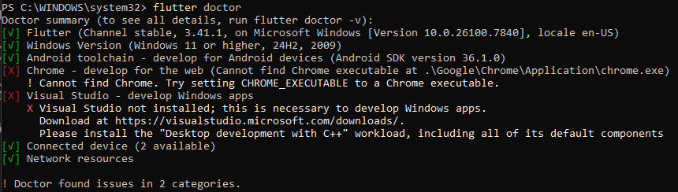

# Laporan Praktikum #01 - Pengantar Pemrograman Mobile

## Identitas Mahasiswa

| Keterangan | Detail |
| :--- | :--- |
| **Nama** | Yosep Bima Aprillian |
| **NIM** | 244107060027 |
| **Kelas** | SIB-2D |

---

## Tugas Praktikum 1

### Hasil Flutter Doctor

Berikut adalah hasil dari perintah `flutter doctor` yang menunjukkan bahwa semua komponen telah terinstal dan terkonfigurasi dengan baik:

> **Catatan:** Semua komponen telah terpasang dengan baik dan tidak ada issue yang ditemukan (`No issues found!`).
