# #10 | Dasar State Management

## Identitas Mahasiswa

| Keterangan | Detail |
| :--- | :--- |
| **Nama** | Yosep Bima Aprillian |
| **NIM** | 244107060027 |
| **Kelas** | SIB-2D |

---

# Praktikum 1: Dasar State dengan Model-View

## Langkah 1: Buat Project Baru

### Hasil "Buat Project Baru":
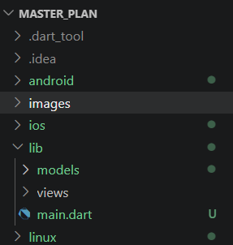

## Langkah 2: Membuat model task.dart

### Hasil "Membuat model task.dart":
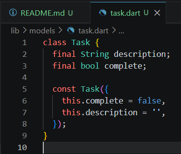

## Langkah 2: Membuat model task.dart

### Hasil "Membuat model task.dart":


## Langkah 3: Buat file plan.dart

### Hasil "Buat file plan.dart":
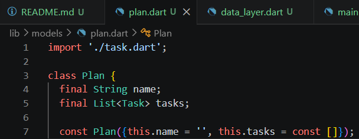

## Langkah 4: Buat file data_layer.dart

### Hasil "Buat file data_layer.dart":
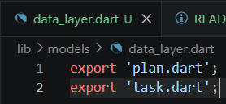

## Langkah 5: Pindah ke file main.dart

### Hasil "Pindah ke file main.dart":
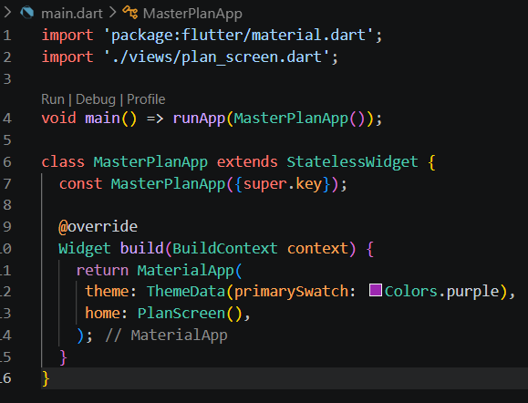

## Langkah 6: buat plan_screen.dart
## Langkah 7: buat method _buildAddTaskButton()
## Langkah 8: buat widget _buildList()
## Langkah 9: buat widget _buildTaskTile

### Hasil "Langkah 6 - 9":
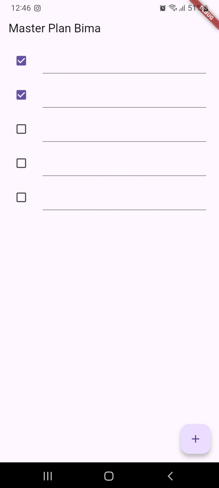

## Langkah 10: Tambah Scroll Controller
## Langkah 11: Tambah Scroll Listener
## Langkah 12: Tambah controller dan keyboard behavior
## Langkah 13: Terakhir, tambah method dispose()

### Hasil "Langkah 10 - 13":
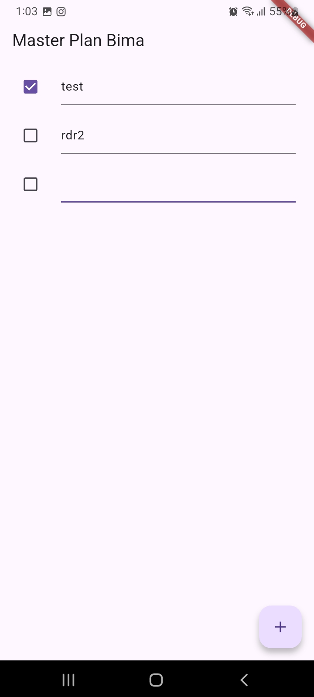

# Tugas Praktikum 1: Dasar State dengan Model-View

1. Selesaikan langkah-langkah praktikum tersebut, lalu dokumentasikan berupa GIF hasil akhir praktikum beserta penjelasannya di file README.md! Jika Anda menemukan ada yang error atau tidak berjalan dengan baik, silakan diperbaiki.
2. Jelaskan maksud dari langkah 4 pada praktikum tersebut! Mengapa dilakukan demikian?
3. Mengapa perlu variabel plan di langkah 6 pada praktikum tersebut? Mengapa dibuat konstanta ?
4. Lakukan capture hasil dari Langkah 9 berupa GIF, kemudian jelaskan apa yang telah Anda buat!
5. Apa kegunaan method pada Langkah 11 dan 13 dalam lifecyle state ?

## Pertanyaan 2: Jelaskan maksud dari langkah 4! Mengapa dilakukan demikian?

**Jawaban:** Langkah 4 membuat **barrel file** (`data_layer.dart`) untuk menyederhanakan impor model. Dengan satu file `data_layer.dart` yang mengekspor `plan.dart` dan `task.dart`, kita hanya perlu impor sekali di file lain, sehingga kode lebih bersih dan mudah dikelola seiring bertambahnya model.

---

## Pertanyaan 3: Mengapa perlu variabel plan? Mengapa dibuat konstanta?

**Jawaban:** 
- **Mengapa perlu:** Variabel `plan` adalah *source of truth* yang menyimpan state aplikasi (data rencana dan daftar tugas). Data ini akan ditampilkan dan diubah di `PlanScreen`.
- **Mengapa konstanta:** Inisialisasi `const Plan()` memberikan nilai awal yang *immutable*. Dalam Flutter, kita mengganti object state lama dengan object baru (via `setState`) daripada memodifikasi properti langsung, untuk menjaga integritas data dan memudahkan pelacakan perubahan.

---

## Pertanyaan 4: Capture hasil Langkah 9 dan jelaskan!

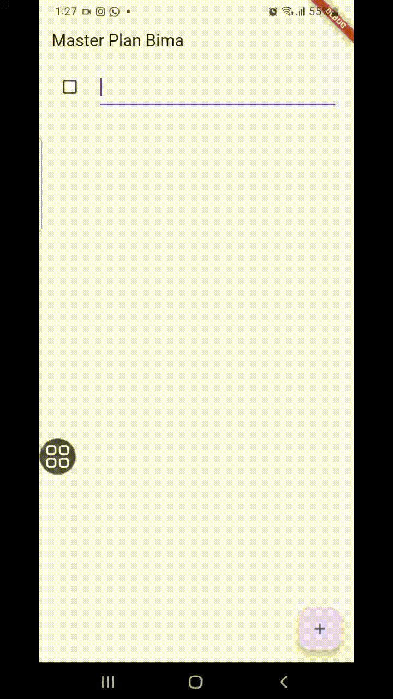

**Jawaban:** Pada Langkah 9, saya telah mengimplementasikan antarmuka To-Do List yang interaktif. Pengguna dapat menambah tugas baru melalui tombol '+', mengetik deskripsi di `TextFormField`, dan menandai status penyelesaian dengan `Checkbox`. ListView.builder digunakan agar aplikasi dapat menangani daftar tugas dalam jumlah banyak secara efisien.

---

## Pertanyaan 5: Apa kegunaan method pada Langkah 11 dan 13 dalam lifecycle state?

### Jawaban:

Kedua method ini adalah bagian dari **Widget Lifecycle** dalam Flutter StatefulWidget:

#### **Langkah 11: Method `initState()`**

```dart
@override
void initState() {
  super.initState();
  scrollController = ScrollController()
    ..addListener(() {
      FocusScope.of(context).requestFocus(FocusNode());
    });
}
```

**Kegunaan:**

1. **Inisialisasi Resource**: Method pertama yang dipanggil saat widget dibuat
2. **Satu kali eksekusi**: Hanya dipanggil **sekali** selama lifecycle widget
3. **Setup ScrollController**:
   - Membuat `ScrKegunaan method pada Langkah 11 dan 13 dalam lifecycle state?

**Jawaban:** 
- **`initState()` (Langkah 11):** Dipanggil sekali saat widget pertama kali dibuat. Digunakan untuk menginisialisasi `ScrollController` dan menambahkan listener yang secara otomatis menghilangkan fokus keyboard saat pengguna melakukan scroll.
- **`dispose()` (Langkah 13):** Dipanggil saat widget dihapus dari tree. Digunakan untuk pembersihan sumber daya (*cleanup*) dengan memanggil `scrollController.dispose()`, sehingga mencegah memory leak dari controller yang tidak ditutup dengan benar.

## Praktikum 2: Mengelola Data Layer dengan InheritedWidget dan InheritedNotifier

## Langkah 1: Buat file plan_provider.dart

### Hasil "Buat file plan_provider.dart":
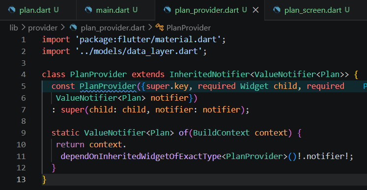

## Langkah 2: Edit main.dart

### Hasil "Edit main.dart":
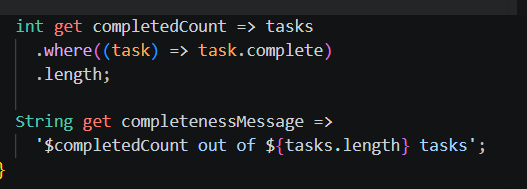

## Langkah 3: Tambah method pada model plan.dart

### Hasil "Tambah method pada model plan.dart":
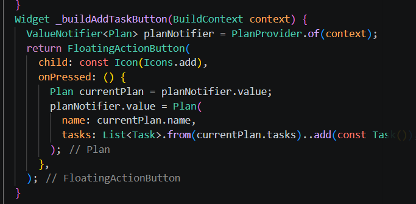

## Langkah 4: Pindah ke PlanScreen
Edit PlanScreen agar menggunakan data dari PlanProvider. Hapus deklarasi variabel plan (ini akan membuat error). Kita akan perbaiki pada langkah 5 berikut ini.

## Langkah 5: Edit method _buildAddTaskButton


## Langkah 6: Edit method _buildTaskTile
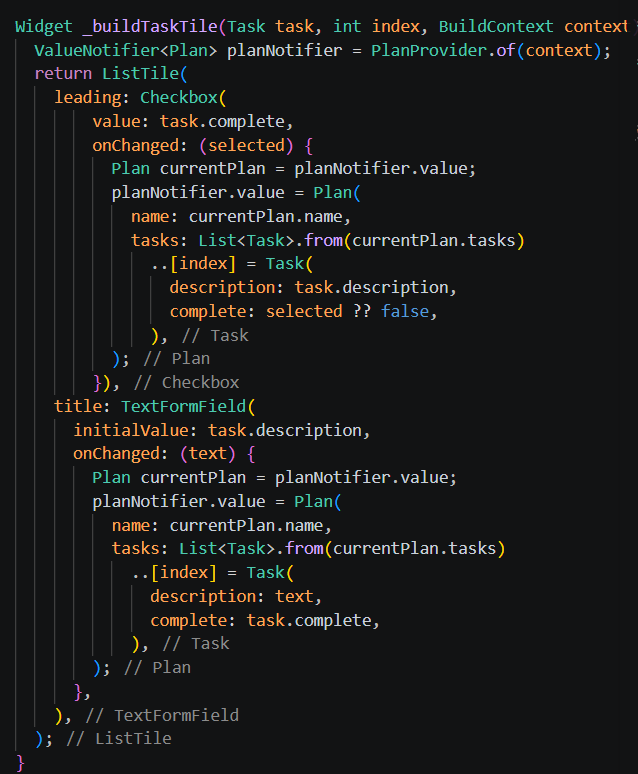

## Langkah 7: Edit _buildList
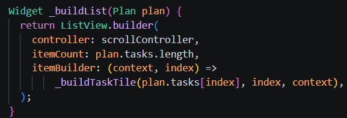

## Langkah 8: Tetap di class PlanScreen
Edit method build sehingga bisa tampil progress pada bagian bawah (footer). Caranya, bungkus (wrap) _buildList dengan widget Expanded dan masukkan ke dalam widget Column seperti kode pada Langkah 9.

## Langkah 9: Tambah widget SafeArea
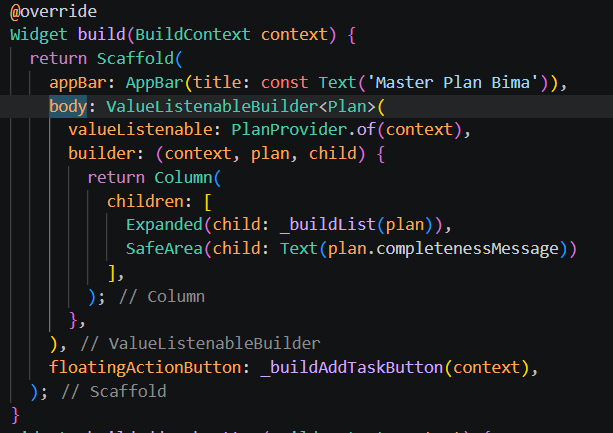

## Hasilnya
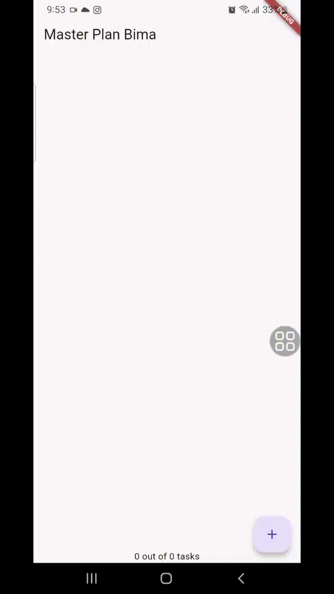

# Tugas Praktikum 2: InheritedWidget

1. **Jelaskan mana yang dimaksud InheritedWidget pada langkah 1 tersebut! Mengapa yang digunakan InheritedNotifier?**
> InheritedWidget pada PlanProvider adalah mekanisme untuk mendistribusikan state ke seluruh descendant widget tanpa harus pass parameter satu per satu.
> Alasan pakai InheritedNotifier:
> - Lebih efisien dibanding InheritedWidget biasa karena hanya mendengarkan perubahan spesifik (via ValueNotifier)
> - Menghindari rebuild seluruh widget tree, hanya widget yang subscribe yang rebuild
> - Integrasi sempurna dengan ValueListenableBuilder untuk reactive UI

2. **Jelaskan maksud dari method di langkah 3 pada praktikum tersebut! Mengapa dilakukan demikian?**
> Method completedCount dan completenessMessage adalah computed properties yang menambah fungsionalitas model tanpa mengubah struktur data.
> Alasan:
> - Memberikan interface yang user-friendly untuk mengakses informasi progres
> - Mengurangi kompleksitas di UI layer (UI hanya butuh panggil property, tidak hitung-hitungan)
> - Membuat model self-contained dan cohesive

3. **Lakukan capture hasil dari Langkah 9 berupa GIF, kemudian jelaskan apa yang telah Anda buat!**
> 
> Pada Langkah 9, saya telah menambahkan fitur indikator progres di bagian bawah layar menggunakan widget `SafeArea` dan `Text`. Status progres ini dibungkus dengan `ValueListenableBuilder` yang terhubung ke `PlanProvider`. Hasilnya, teks progres akan diperbarui secara otomatis dan *real-time* setiap kali pengguna menambah tugas baru atau mencentang kotak status tugas, memberikan umpan balik langsung mengenai sejauh mana rencana tugas telah diselesaikan.

# Praktikum 3: Membuat State di Multiple Screens

## Langkah 1: Edit PlanProvider
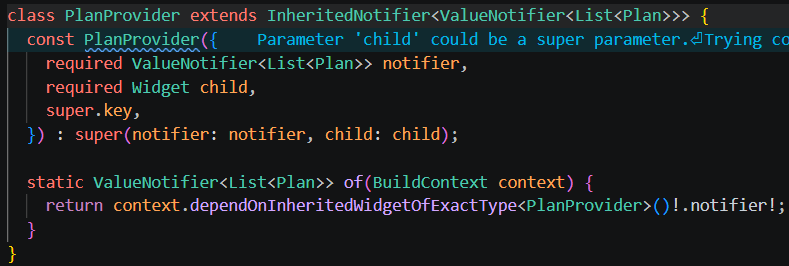

## Langkah 2: Edit main.dart
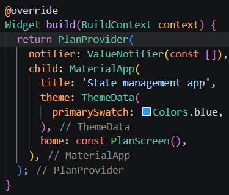

## Langkah 3: Edit plan_screen.dart
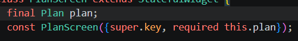

## Langkah 4: Error
Itu akan terjadi error setiap kali memanggil PlanProvider.of(context). Itu terjadi karena screen saat ini hanya menerima tugas-tugas untuk satu kelompok Plan, tapi sekarang PlanProvider menjadi list dari objek plan tersebut.

## Langkah 5: Tambah getter Plan
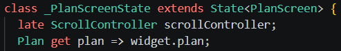

## Langkah 6: Method initState()
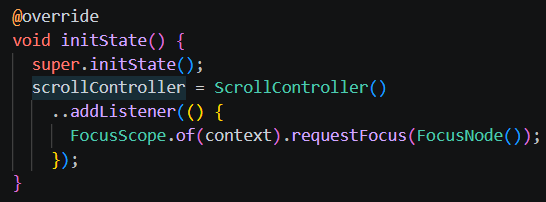

## Langkah 7: Widget build
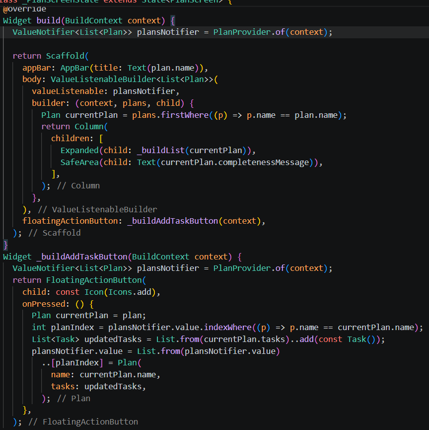

## Langkah 8: Edit _buildTaskTile
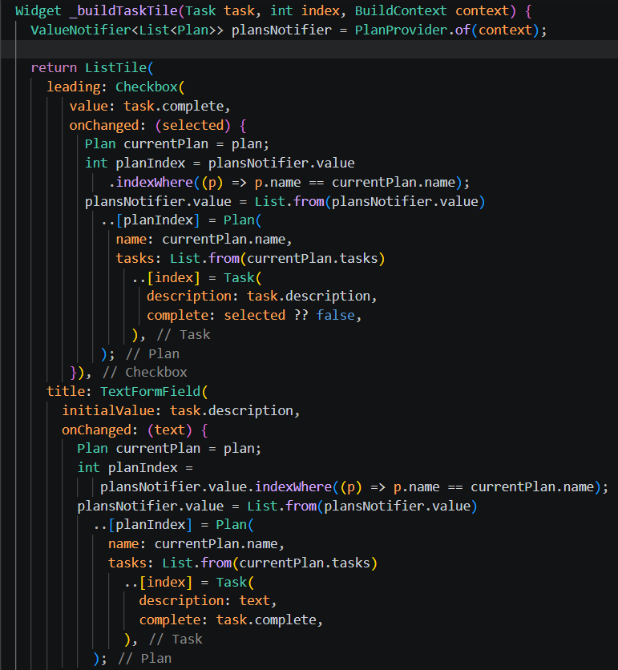

## Langkah 9: Buat screen baru
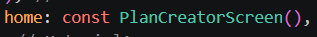

## Langkah 10: Pindah ke class _PlanCreatorScreenState
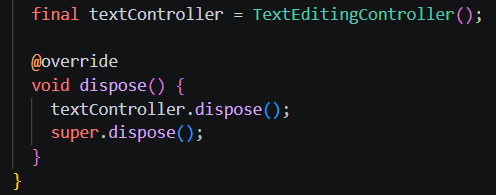

## Langkah 11: Pindah ke method build
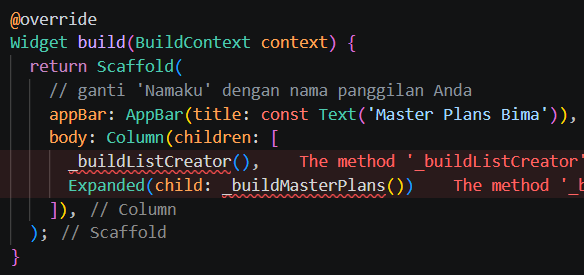

## Langkah 12: Buat widget _buildListCreator
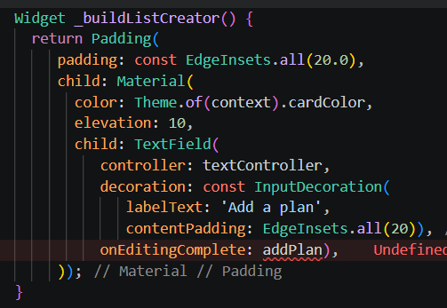

## Langkah 13: Buat void addPlan()
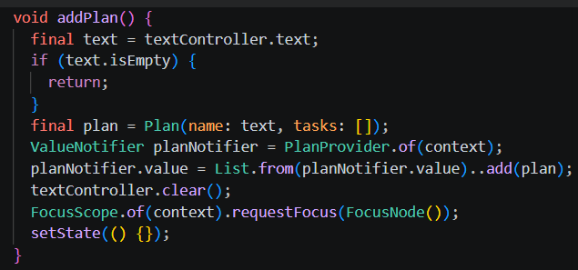

## Langkah 14: Buat widget _buildMasterPlans()
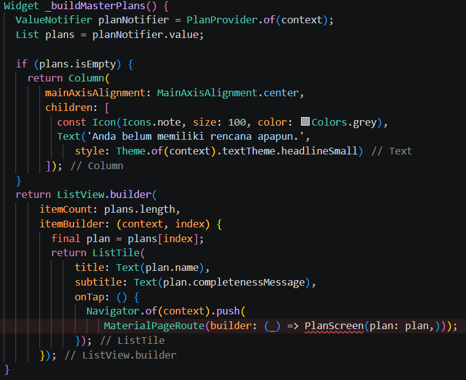

## Hasilnya:
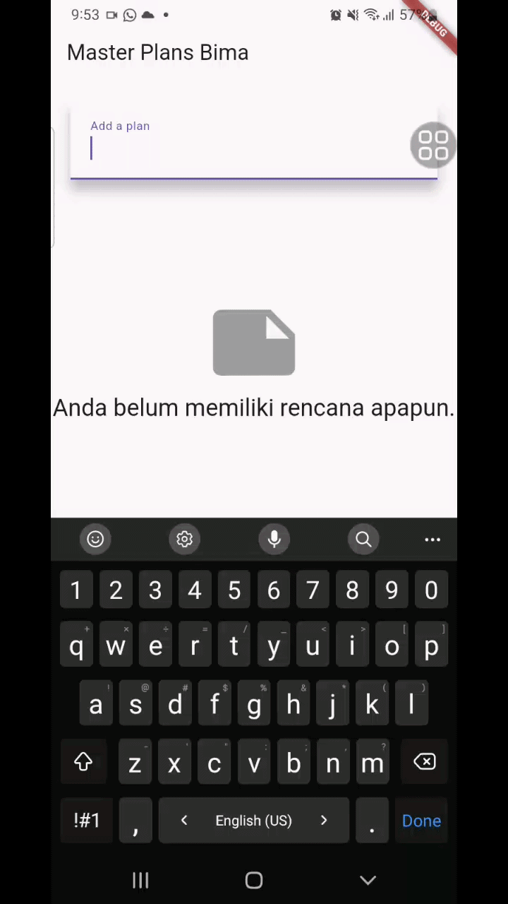

# Tugas Praktikum 3: State di Multiple Screens
1. Selesaikan langkah-langkah praktikum tersebut, lalu dokumentasikan berupa GIF hasil akhir praktikum beserta penjelasannya di file README.md! Jika Anda menemukan ada yang error atau tidak berjalan dengan baik, silakan diperbaiki sesuai dengan tujuan aplikasi tersebut dibuat.

2. Berdasarkan Praktikum 3 yang telah Anda lakukan, jelaskan maksud dari gambar diagram berikut ini!
   > **Jawab:**
   > Diagram tersebut menunjukkan implementasi konsep **"Lifting State Up"**. Dengan menempatkan `PlanProvider` di atas `MaterialApp`, *state* aplikasi (daftar rencana) menjadi tersedia bagi seluruh pohon widget di bawahnya. Hal ini memungkinkan `PlanCreatorScreen` dan `PlanScreen` untuk mengakses dan memodifikasi sumber data yang sama secara sinkron. Ketika data diubah melalui salah satu layar, layar lainnya akan secara otomatis mendapatkan pembaruan karena keduanya terhubung ke *notifier* yang sama dalam `PlanProvider`.

3. Lakukan capture hasil dari Langkah 14 berupa GIF, kemudian jelaskan apa yang telah Anda buat!
   > **Jawab:**
   > 
   > Yang telah saya buat adalah sebuah aplikasi pengelola rencana yang dinamis dengan fitur:
   > - **Layar Pembuat Rencana (`PlanCreatorScreen`)**: Memungkinkan pengguna membuat berbagai kategori rencana (misal: "Kuliah", "Belanja"). Layar ini menampilkan ringkasan progres dari setiap rencana.
   > - **Layar Detail Rencana (`PlanScreen`)**: Memungkinkan pengguna menambah dan mengelola tugas spesifik di dalam rencana yang dipilih.
   > - **Navigasi & Sinkronisasi**: Aplikasi menggunakan `Navigator` untuk berpindah antar layar, namun data tetap konsisten karena dikelola oleh satu *provider* pusat yang berada di level *root* aplikasi.

4. Kumpulkan laporan praktikum Anda berupa link commit atau repository GitHub ke dosen yang telah disepakati !