# #11 | Pemrograman Asynchronous

## Identitas Mahasiswa

| Keterangan | Detail |
| :--- | :--- |
| **Nama** | Yosep Bima Aprillian |
| **NIM** | 244107060027 |
| **Kelas** | SIB-2D |

---

# Praktikum 1: Mengunduh Data dari Web Service (API)

## Langkah 1: Buat Project Baru
> **Soal 1**
> Tambahkan **nama panggilan Anda** pada `title` app sebagai identitas hasil pekerjaan Anda.
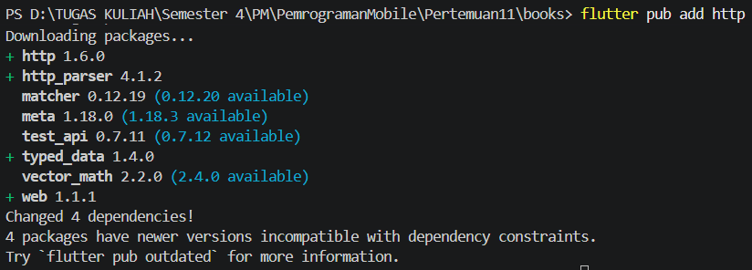

## Langkah 2: Cek file pubspec.yaml
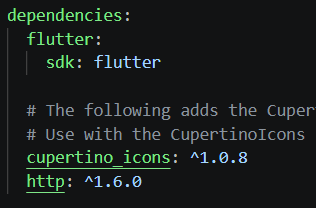

## Langkah 3: Buka file main.dart
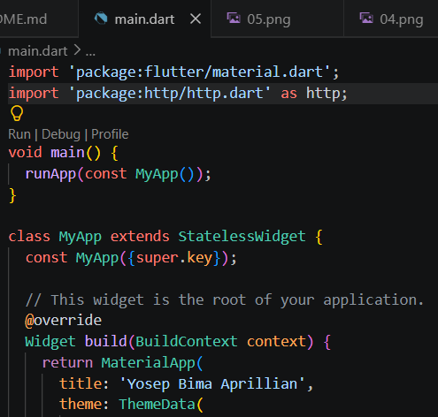

## Langkah 4: Tambah method getData()
> **Soal 2**
>
> - Carilah judul buku favorit Anda di Google Books, lalu ganti ID buku pada variabel `path` di kode tersebut. Caranya ambil di URL browser Anda seperti gambar berikut ini.
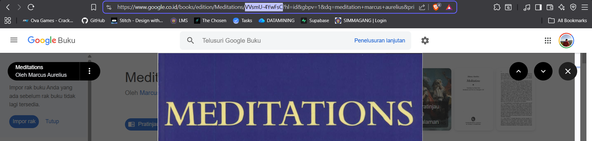
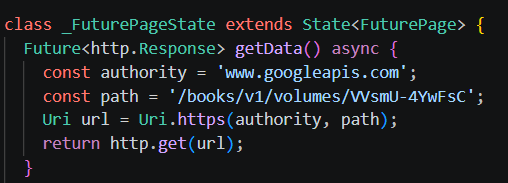
> - Kemudian cobalah akses di browser URI tersebut dengan lengkap seperti ini. Jika menampilkan data JSON, maka Anda telah berhasil. Lakukan _capture_ milik Anda dan tulis di `README` pada laporan praktikum. Lalu lakukan commit dengan pesan "**W11: Soal 2**".
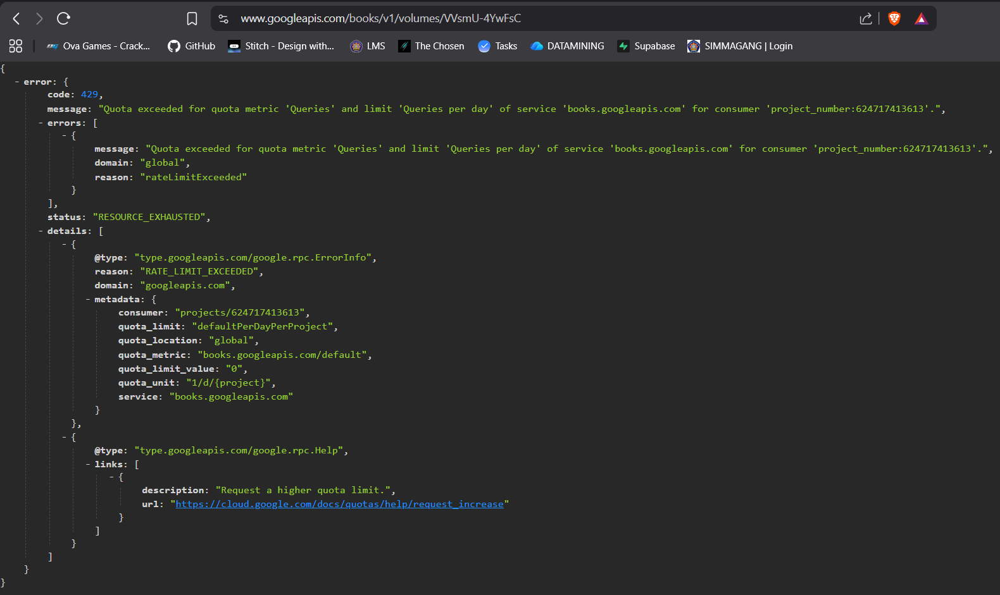

## Langkah 5: Tambah kode di ElevatedButton
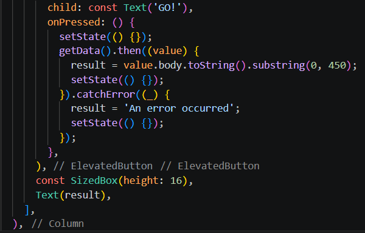
### Hasil
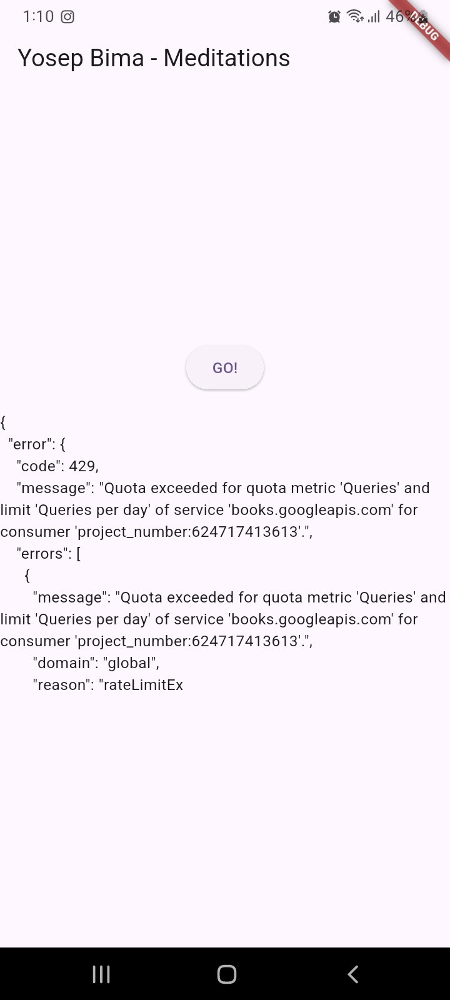
> **Soal 3**
> - Jelaskan maksud kode langkah 5 tersebut terkait `substring` dan `catchError`!
- `substring()`: digunakan untuk mengambil sebagian kecil string berdasarkan indeks awal dan akhir yang diberikan. Pada kode tersebut, digunakan untuk mengambil 450 karakter pertama dari string yang dikembalikan oleh Future `getData()`. Jika string terlalu panjang, maka akan dipotong menjadi 450 karakter.
- `catchError()`: digunakan untuk menangani error yang terjadi pada Future (`getData()`), jika tidak ada error maka akan mengembalikan nilai dari Future, jika ada error maka akan mengembalikan nilai dari error.

# Praktikum 2: Menggunakan await/async untuk menghindari callbacks

## Langkah 1: Buka file main.dart
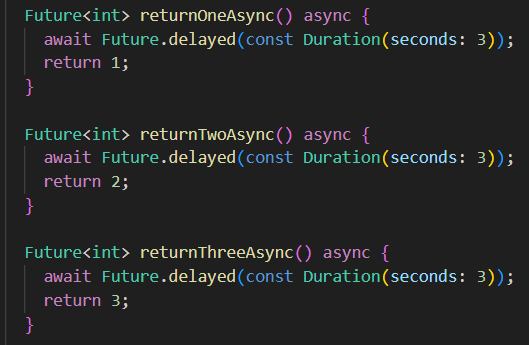

## Langkah 2: Tambah method count()
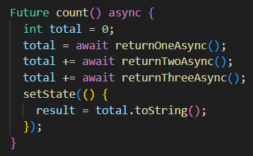

## Langkah 3: Panggil count()
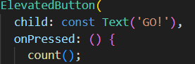

## Langkah 4: Run

> **Soal 4**
> - Jelaskan maksud kode langkah 1 dan 2 tersebut!
- **Langkah 1:** Kita membuat tiga fungsi asynchronous (`returnOneAsync`, `returnTwoAsync`, dan `returnThreeAsync`). Masing-masing fungsi mengembalikan nilai `Future<int>` dan mensimulasikan proses yang membutuhkan waktu (seperti mengambil data dari internet) menggunakan `await Future.delayed(const Duration(seconds: 3))`. Ini berarti setiap fungsi akan berhenti (menunggu) selama 3 detik sebelum mengembalikan angka (1, 2, atau 3).
- **Langkah 2:** Kita membuat fungsi `count()` yang juga bersifat asynchronous. Fungsi ini memanggil ketiga fungsi dari Langkah 1 secara berurutan menggunakan kata kunci `await`. Karena menggunakan `await`, eksekusi akan menunggu sampai `returnOneAsync()` selesai (3 detik), lalu menjumlahkannya ke variabel `total`. Kemudian menunggu lagi `returnTwoAsync()` selesai (3 detik), dan terakhir menunggu `returnThreeAsync()` (3 detik). Total waktu tunggu adalah sekitar 9 detik. Setelah semuanya selesai, `setState()` dipanggil untuk memperbarui tampilan antarmuka dengan nilai `total` (yaitu 6).

# Praktikum 3: Menggunakan Completer di Future

## Langkah 1: Buka main.dart
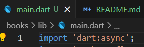

## Langkah 2: Tambahkan variabel dan method
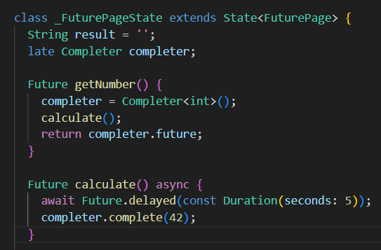

## Langkah 3: Ganti isi kode onPressed()
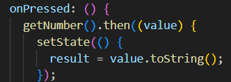

> **Soal 5**
> - Jelaskan maksud kode langkah 2 tersebut!
- **`late Completer completer;`**: Kita mendeklarasikan sebuah variabel `completer` bertipe `Completer`. Objek ini berfungsi untuk membuat sebuah `Future` yang penyelesaiannya (berupa nilai kembalian atau error) dapat kita kontrol dan berikan nanti (*late*).
- **`getNumber()`**: Fungsi ini bertugas menginisialisasi objek `completer` yang baru. Kemudian ia memanggil fungsi `calculate()` untuk menjalankan proses di latar belakang, dan langsung mengembalikan `completer.future` tanpa menunggu `calculate()` selesai. `Future` inilah yang nanti ditangkap oleh fungsi `onPressed()` dan ditunggu hasilnya menggunakan `.then()`.
- **`calculate()`**: Fungsi ini menyimulasikan proses asinkron yang memakan waktu (menunggu selama 5 detik menggunakan `Future.delayed`). Setelah jeda waktu tersebut selesai, fungsi ini memanggil `completer.complete(42)`. Baris kode ini berfungsi untuk memberitahu `completer` bahwa proses telah selesai dan memberikan nilai `42` kepada `completer.future` yang sebelumnya telah di-return di `getNumber()`.

> - Capture hasil praktikum Anda berupa GIF dan lampirkan di README. Lalu lakukan commit dengan pesan "W11: Soal 5".

## Langkah 5: Ganti method calculate()
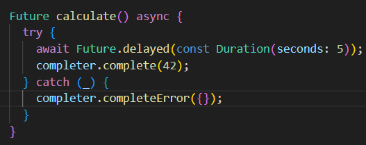

## Langkah 6: Pindah ke onPressed()
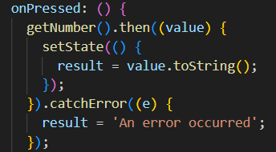

> **Soal 6**
> - Jelaskan maksud perbedaan kode langkah 2 dengan langkah 5-6 tersebut!
- **Pada Langkah 2**: Fungsi `calculate()` tidak menangani potensi error yang mungkin terjadi. Saat dijalankan, ia hanya menggunakan *delay* lalu langsung memanggil `completer.complete(42)`. Jika ada masalah (atau ditekan dua kali berturut-turut), tidak ada penanganan, sehingga aplikasi bisa mengalami *crash* dan memunculkan error seperti `StateError: Bad state: Future already completed`. Pemanggilan di `onPressed()` pun belum menyiapkan fitur untuk "menangkap" error yang datang.
- **Pada Langkah 5 & 6**: Di Langkah 5, fungsi `calculate()` ditambahkan struktur `try-catch`. Jika ada kesalahan apa pun pada eksekusi asinkron, sistem akan menangkap kesalahan tersebut lewat `catch` dan menyalurkannya dengan aman menggunakan `completer.completeError({})`. Di Langkah 6, fungsi yang memanggil `getNumber()` di dalam `onPressed()` ditambahkan metode `.catchError()`. Dengan adanya tambahan tersebut, semua error yang dikirimkan oleh `completer.completeError` akan ditangkap oleh fungsi `.catchError()`, sehingga nilai `result` bisa diubah menjadi pesan teks ("An error occurred") tanpa menyebabkan aplikasi *crash*. Singkatnya, ini adalah praktik pembuatan Future dengan *error handling* yang benar.

# Praktikum 4: Memanggil Future secara paralel

## Langkah 1: Buka file main.dart
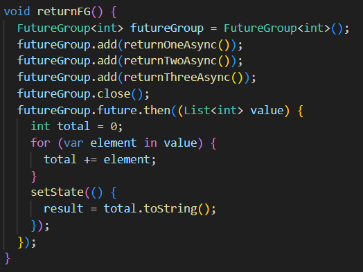

## Langkah 2: Edit onPressed()
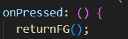

## Langkah 3: Run
> **Soal 7**
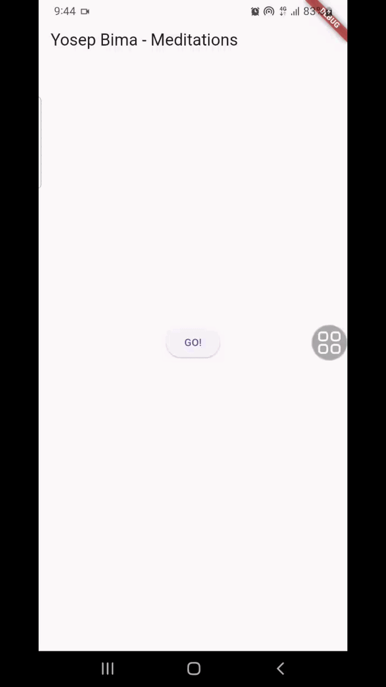

## Langkah 4: Ganti variabel futureGroup
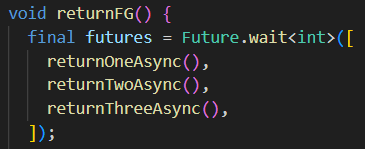

> **Soal 8**
> - Jelaskan maksud perbedaan kode langkah 1 dan 4!
- **Pada Langkah 1**: Kita menggunakan class `FutureGroup` dari *package* `async`. `FutureGroup` memungkinkan kita untuk menambahkan beberapa objek `Future` secara dinamis satu per satu menggunakan method `.add()`. Setelah semua *Future* dimasukkan, kita harus memanggil `.close()` untuk menandai bahwa kelompok *Future* tersebut sudah ditutup (selesai ditambah). Barulah kemudian kita bisa menunggu hasilnya dengan memanggil `.future.then(...)`. Cara ini sangat berguna apabila jumlah *Future* yang akan dieksekusi belum diketahui secara pasti di awal dan perlu ditambahkan secara bertahap seiring berjalannya program.
- **Pada Langkah 4**: Kita menggunakan `Future.wait()`, yang merupakan fungsi bawaan dari core Dart API (tanpa perlu import `package:async/async.dart`). Pada `Future.wait()`, kita harus memasukkan semua *Future* secara bersamaan sekaligus di awal dalam bentuk tipe data *List* atau *Array* (seperti `[returnOneAsync(), returnTwoAsync(), returnThreeAsync()]`). Cara ini jauh lebih praktis, singkat, dan mudah dibaca (lebih *clean*) jika sejak awal kita sudah mengetahui secara persis fungsi asinkron apa saja yang ingin dijalankan secara paralel. Hasil akhirnya sama dengan Langkah 1, yakni menjalankan *Future* secara paralel dan mengembalikan total nilainya ketika semuanya telah selesai (yakni `6`).

# Praktikum 5: Menangani Respon Error pada Async Code

## Langkah 1: Buka file main.dart
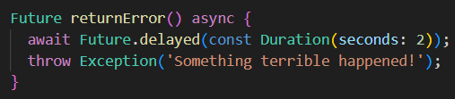

## Langkah 2: ElevatedButton
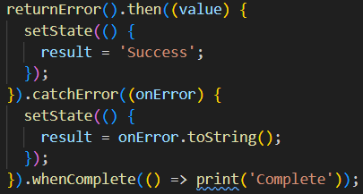

## Langkah 3: Run
> **Soal 9**
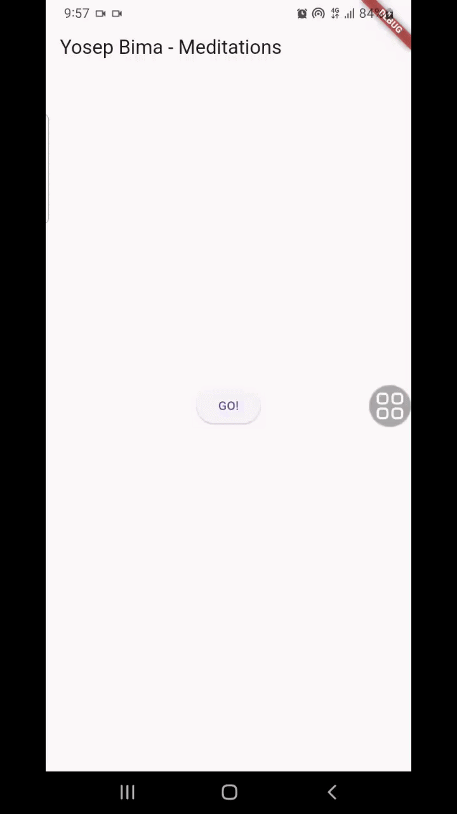

## Langkah 4: Tambah method handleError()
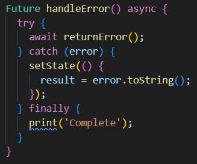

> **Soal 10**
> - Panggil method handleError() tersebut di ElevatedButton, lalu run. Apa hasilnya? Jelaskan perbedaan kode langkah 1 dan 4!
- **Hasilnya**: Sama seperti Langkah 2, setelah menekan tombol "GO!" dan menunggu 2 detik, tampilan teks di tengah layar akan berubah menjadi pesan error `Exception: Something terrible happened!`, sedangkan di *Debug Console* akan tercetak tulisan `Complete`. Prosesnya adalah fungsi `handleError()` mencoba menjalankan `returnError()` di dalam blok `try`, lalu fungsi tersebut dengan sengaja melempar Exception. Karena ada *error*, program langsung melompat ke blok `catch` untuk memperbarui antarmuka lewat `setState`, dan diakhiri dengan mengeksekusi blok `finally` secara mutlak untuk mencetak 'Complete'.
- **Perbedaan Langkah 1 dan 4**: 
  - Pada **Langkah 1**: Penanganan *error* menggunakan pendekatan **Callback** dengan fungsi `.then()`, `.catchError()`, dan `.whenComplete()`. Pola ini bisa jadi membingungkan jika proses asinkronnya sangat banyak karena bentuknya akan semakin menjorok ke dalam (bersarang).
  - Pada **Langkah 4**: Penanganan *error* menggunakan pendekatan **Async/Await** yang digabungkan dengan struktur blok konvensional **Try-Catch-Finally**. Pendekatan ini merupakan fitur modern Dart yang sangat direkomendasikan karena kodenya terlihat jauh lebih rapi, *clean*, dan dibaca mengalir dari atas ke bawah seolah-olah merupakan kode program yang berjalan secara berurutan (*synchronous*).

# Praktikum 6: Menggunakan Future dengan StatefulWidget
  
## Langkah 1: install plugin geolocator
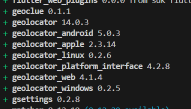

## Langkah 2: Tambah permission GPS
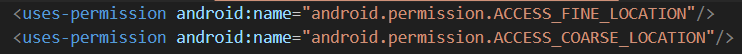

## Langkah 3: Buat file geolocation.dart
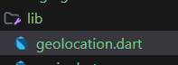

## Langkah 4: Buat StatefulWidget
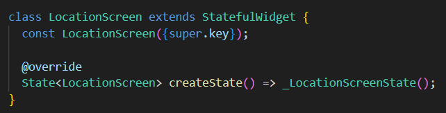

## Langkah 5: Isi kode geolocation.dart
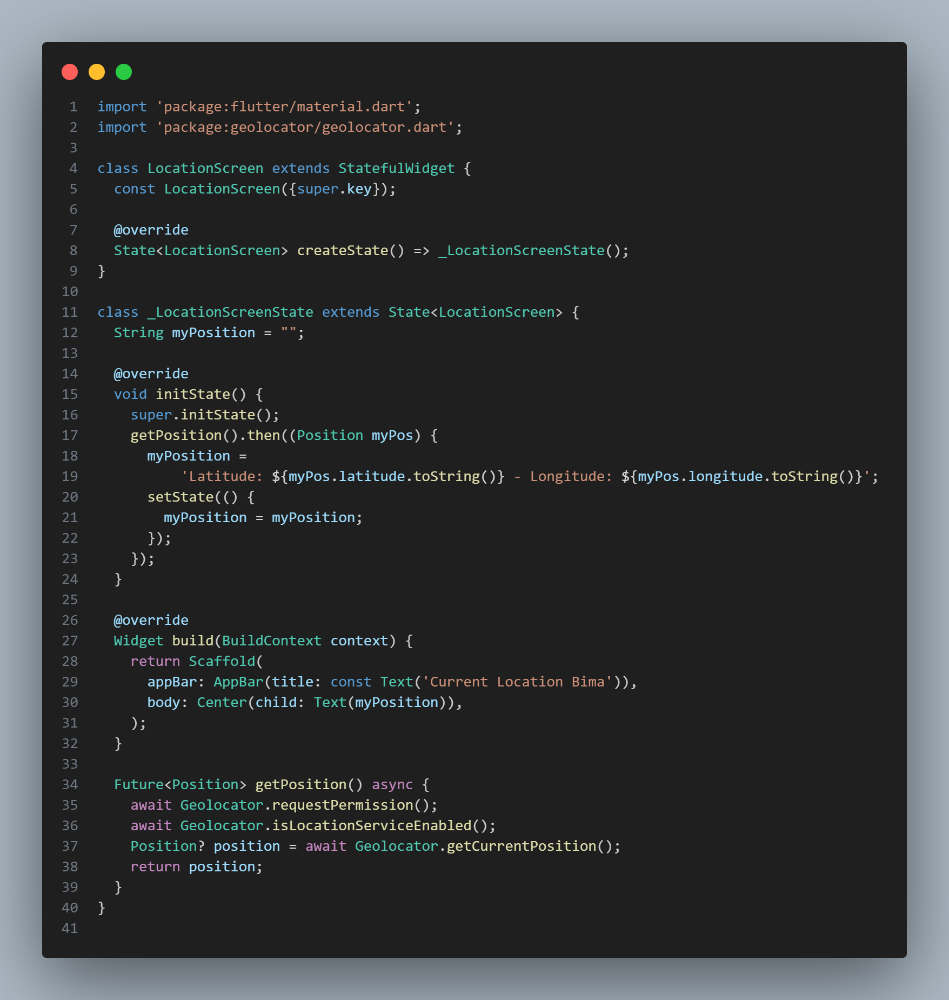

> **Soal 11**
> - Tambahkan nama panggilan Anda pada tiap properti title sebagai identitas pekerjaan Anda.
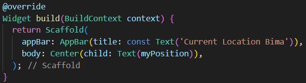

## Langkah 6: Edit main.dart
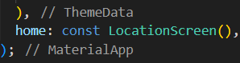

## Langkah 7: Run
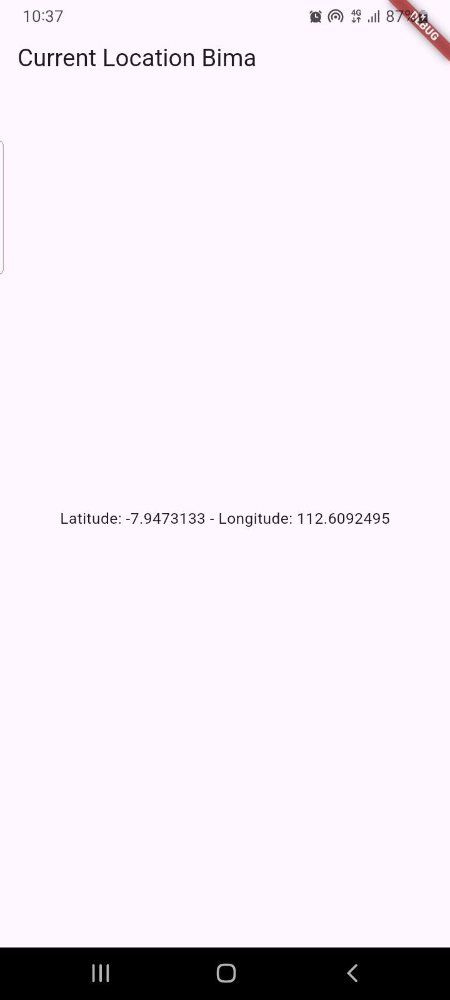

## Langkah 8: Tambahkan animasi loading
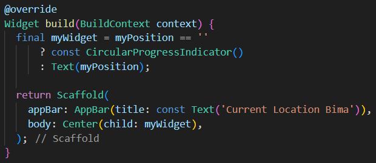

> **Soal 12**
> - Jika Anda tidak melihat animasi loading tampil, kemungkinan itu berjalan sangat cepat. Tambahkan delay pada method getPosition() dengan kode `await Future.delayed(const Duration(seconds: 3));`
> - Apakah Anda mendapatkan koordinat GPS ketika run di browser? Mengapa demikian?
- **Jawab**: Ya, aplikasi tetap bisa mendapatkan koordinat lokasi meskipun dijalankan melalui browser (Flutter Web). Hal ini dimungkinkan karena *browser* modern (seperti Chrome, Edge, Safari) memiliki fitur **HTML5 Geolocation API** bawaan. Walaupun PC atau laptop kita rata-rata tidak memiliki sensor perangkat keras GPS fisik layaknya *smartphone*, *browser* bisa "menebak" atau memperkirakan posisi kita berdasarkan jaringan (*Network-based positioning*) melalui data-data seperti alamat IP publik dan lokasi jaringan Wi-Fi di sekitar. *Package* `geolocator` di Flutter cukup pintar untuk memanggil API *browser* ini secara otomatis ketika mendeteksi aplikasinya di-run di platform web.

# Praktikum 7: Manajemen Future dengan FutureBuilder

## Langkah 1: Modifikasi method getPosition()
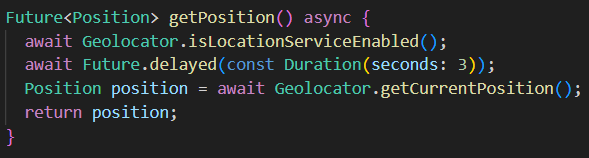

## Langkah 2: Tambah variabel
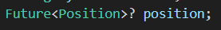

## Langkah 3: Tambah initState()
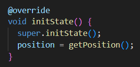

## Langkah 4: Edit method build()
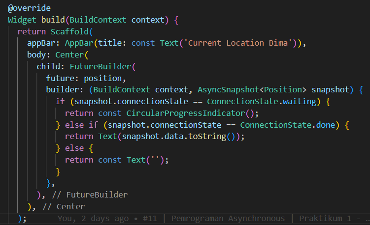

> **Soal 13**
> - Apakah ada perbedaan UI dengan praktikum sebelumnya? Mengapa demikian?
- **Jawab**: Secara *User Interface* (UI) yang tampil di layar, **tidak ada perbedaan yang terlihat**. Keduanya sama-sama menampilkan indikator putaran *loading* selama beberapa detik, lalu kemudian menampilkan teks koordinat lokasi. Namun, perbedaan yang sangat besar terjadi di balik layar (secara struktur kode). Pada praktikum sebelumnya, kita mengelola status *loading* secara manual dengan memanggil `setState()` berulang kali. Sedangkan pada praktikum 7 ini, kita menyerahkan pengelolaan tersebut sepenuhnya kepada widget `FutureBuilder`. `FutureBuilder` akan secara cerdas memantau *state* (status) dari *Future* dan secara otomatis me-*rebuild* (menggambar ulang) UI-nya sendiri saat *Future* berganti dari status `waiting` menjadi `done`, sehingga kode kita menjadi jauh lebih bersih, efisien, dan kita tidak perlu repot memanggil `setState` secara manual.
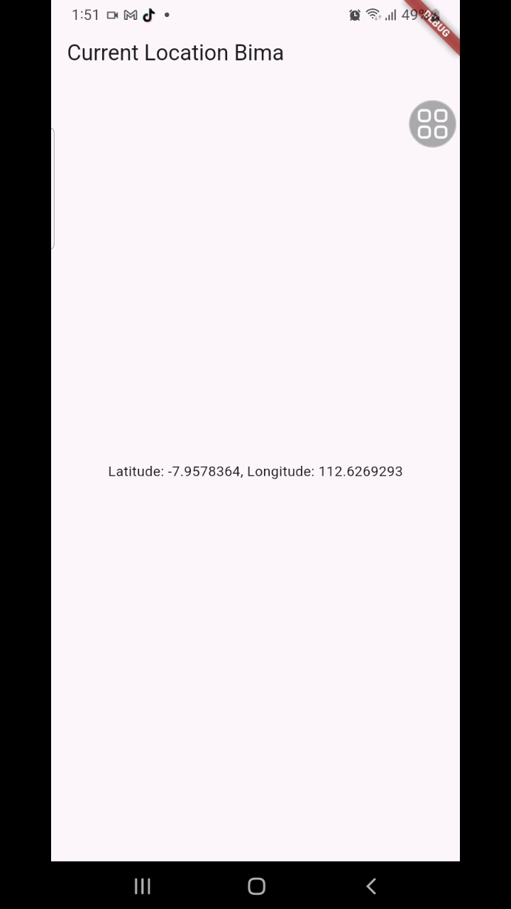

## Langkah 5: Tambah handling error
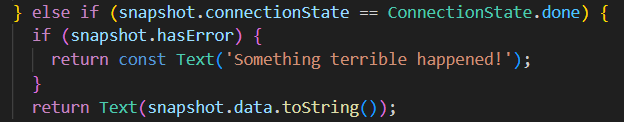

> **Soal 14**
> - Apakah ada perbedaan UI dengan langkah sebelumnya? Mengapa demikian?
- **Jawab**: **Tidak ada perbedaan UI** yang terlihat jika aplikasi berjalan dengan normal. Layar akan tetap menampilkan animasi *loading* lalu diikuti dengan teks koordinat. Hal ini terjadi karena kode yang baru saja kita tambahkan hanyalah sebuah blok penanganan kesalahan (*error handling*). Kondisi `if (snapshot.hasError)` bertindak sebagai jaring pengaman (fallback) yang hanya akan tereksekusi dan merubah UI (menampilkan teks *"Something terrible happened!"*) **apabila** terjadi kegagalan saat mengambil lokasi (misalnya layanan GPS perangkat dimatikan atau *Exception* sengaja dilempar). Karena metode `getPosition()` saat ini berhasil merespons tanpa masalah, maka blok *error* tersebut dilewati dan hasil UI yang ditampilkan persis sama dengan langkah sebelumnya.

# Praktikum 8: Navigation route dengan Future Function

## Langkah 1: Buat file baru navigation_first.dart
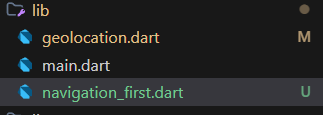

## Langkah 2: Isi kode navigation_first.dart
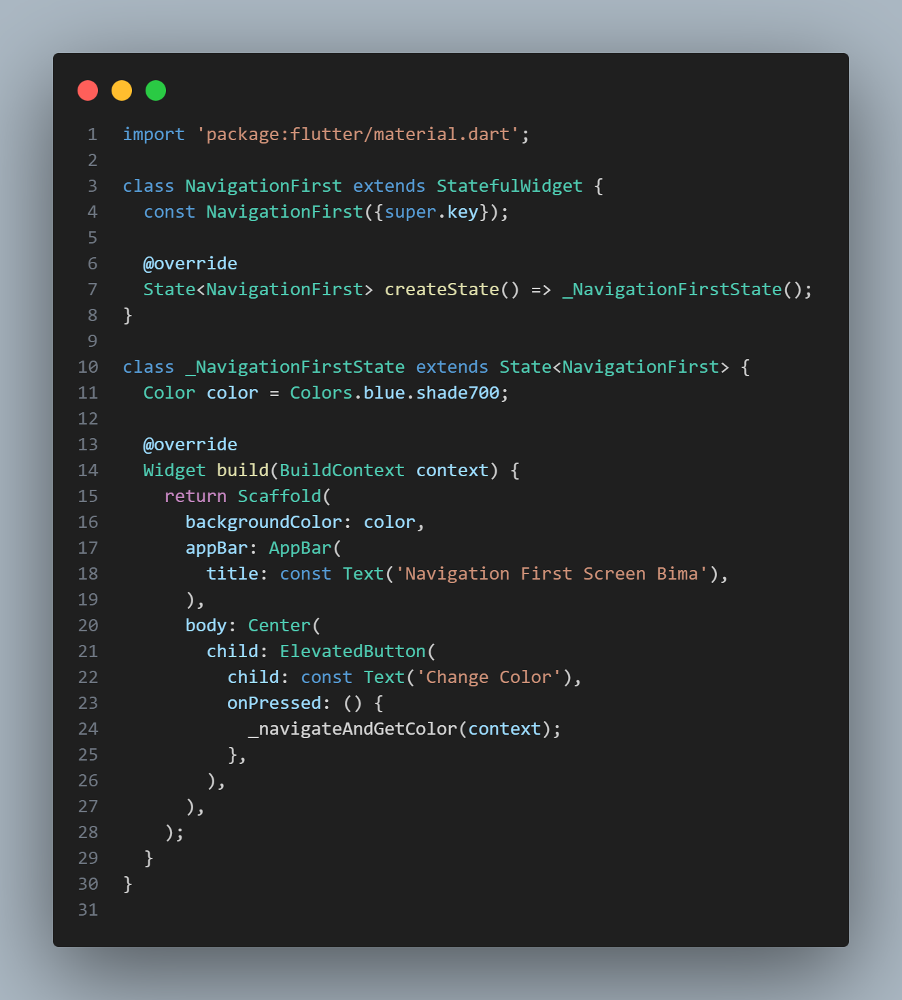

> **Soal 15**
> - Tambahkan nama panggilan Anda pada tiap properti title sebagai identitas pekerjaan Anda.
> 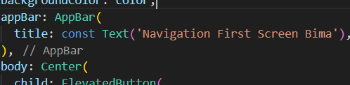
> - Silakan ganti dengan warna tema favorit Anda.

## Langkah 3: Tambah method di class _NavigationFirstState
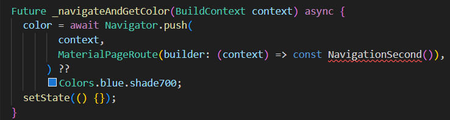

## Langkah 4: Buat file baru navigation_second.dart
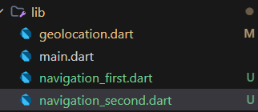

## Langkah 5: Buat class NavigationSecond dengan StatefulWidget
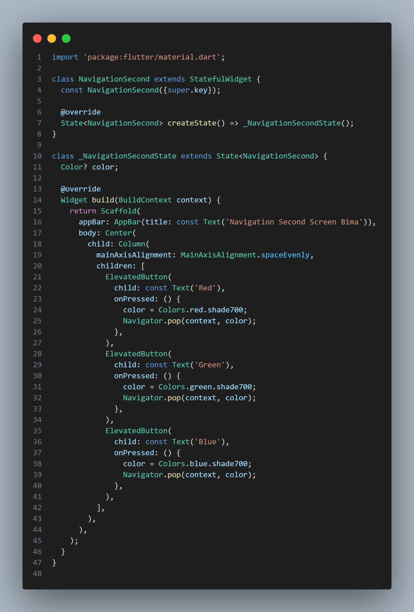

## Langkah 6: Edit main.dart
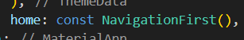

## Langkah 8: Run

> **Soal 16**
> - Cobalah klik setiap button, apa yang terjadi ? Mengapa demikian ?
  - **Yang terjadi**: Ketika salah satu tombol warna diklik pada layar kedua, layar tersebut langsung menutup (hilang dari pandangan), dan layar pertama akan muncul kembali dengan warna latar belakang yang telah berubah seketika sesuai warna tombol yang dipilih.
  - **Mengapa demikian**: Hal ini merupakan wujud nyata dari konsep *Future Function* dalam sistem Route (navigasi). Pemanggilan `Navigator.push()` pada layar pertama disematkan *keyword* `await`, yang berarti aplikasi "menunggu" data/nilai kembalian (*return value*) yang dihasilkan oleh layar kedua. Di sisi lain, pada layar kedua, saat tombol diklik ia memanggil `Navigator.pop(context, color);`. Fungsi `pop` ini selain menutup layar, juga memiliki kapabilitas untuk membawa "oleh-oleh" berupa variabel `color` yang kita kirimkan kembali kepada layar pertama yang sedang menunggu tadi. Setelah warna diterima, baris `setState(() {});` pun langsung tereksekusi sehingga layar pertama tergambar ulang (*rebuild*) menggunakan warna yang baru.
> - Gantilah 3 warna pada langkah 5 dengan warna favorit Anda! (Biru, Merah, dan Ungu)
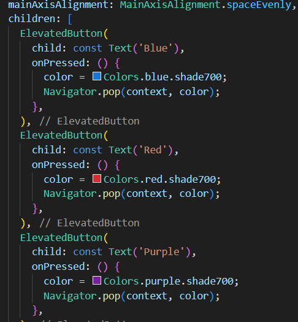
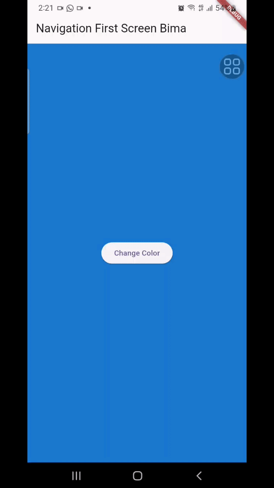

# Praktikum 9: Memanfaatkan async/await dengan Widget Dialog

## Langkah 1: Buat file baru navigation_dialog.dart
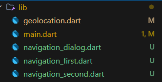

## Langkah 2: Isi kode navigation_dialog.dart
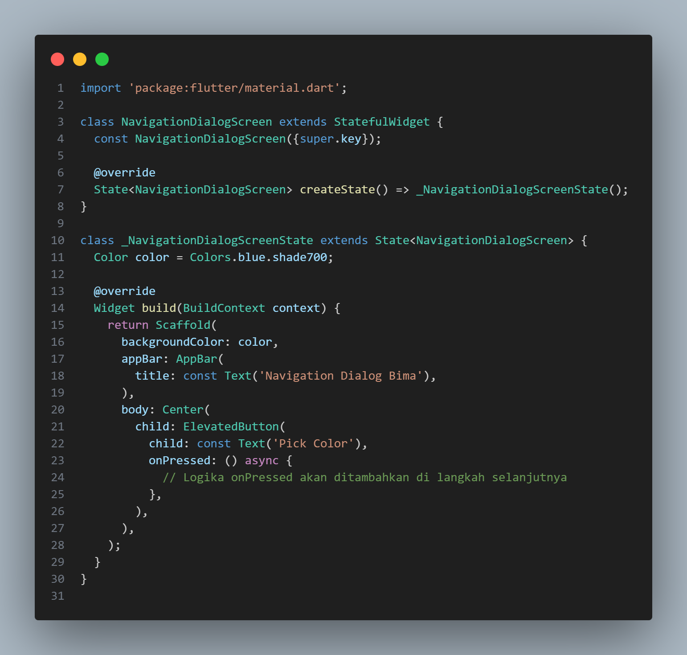

## Langkah 3: Tambah method async
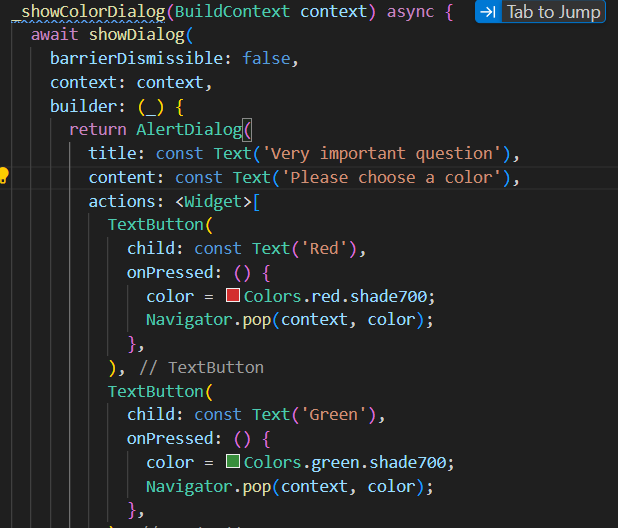

## Langkah 4: Panggil method di ElevatedButton
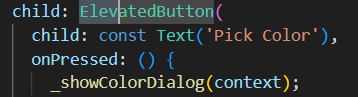

## Langkah 5: Edit main.dart
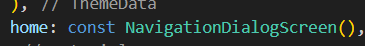

## Langkah 6: Run
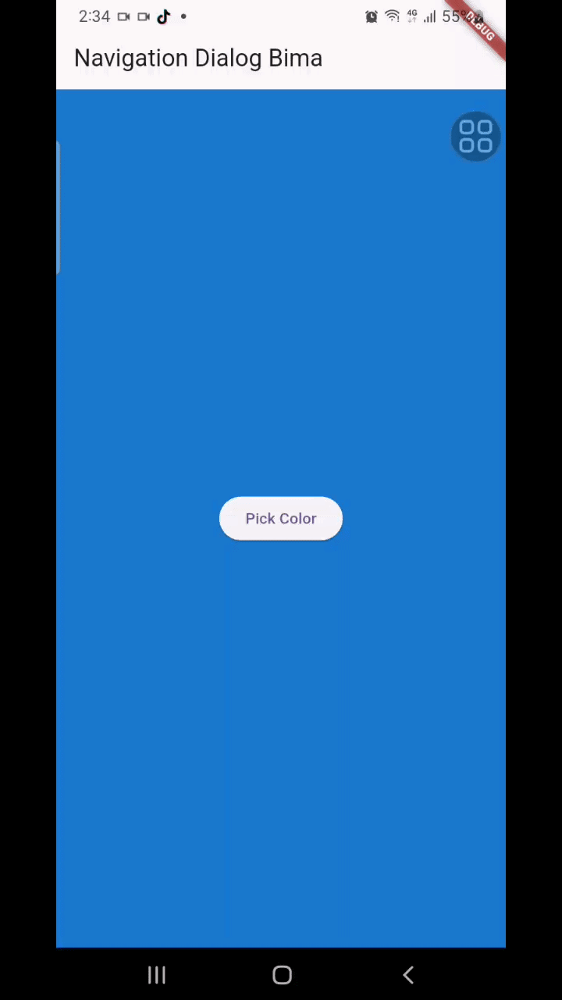

> **Soal 17**
> - Cobalah klik setiap button, apa yang terjadi ? Mengapa demikian ?
  - **Yang terjadi**: Ketika tombol "Pick Color" diklik, sebuah *pop-up dialog* muncul. Ketika salah satu tombol warna di dalam dialog tersebut diklik (misalnya *Blue*), kotak dialog akan menutup dan warna latar belakang dari layar utama langsung berubah menjadi warna yang dipilih tersebut.
  - **Mengapa demikian**: Hal ini dimungkinkan karena metode `showDialog` di Flutter pada dasarnya mengembalikan sebuah *Future* (sama seperti navigasi layar biasa). Saat kita mengeklik tombol pada dialog, method `Navigator.pop(context, color)` dijalankan, yang bertujuan untuk menutup dialog sekaligus "mengirimkan" variabel `color` (sebagai nilai kembalian) kembali ke pemanggil `showDialog`. Karena pemanggilnya memiliki instruksi `await showDialog(...)`, baris kode di bawahnya (yaitu `setState(() {});`) baru akan dieksekusi **setelah** dialog tersebut benar-benar ditutup dan nilainya diterima, yang pada akhirnya memicu layar untuk menggambar ulang antarmukanya (*rebuild*) dengan menggunakan *state* warna yang baru diset tersebut.
> - Gantilah 3 warna pada langkah 3 dengan warna favorit Anda!
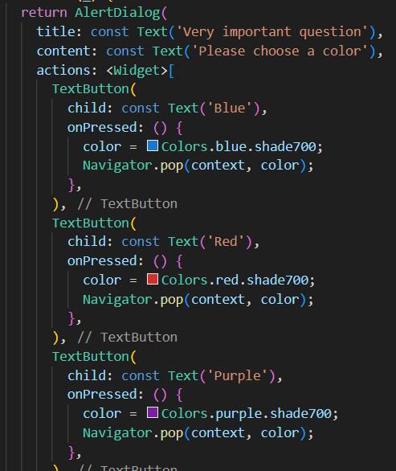
