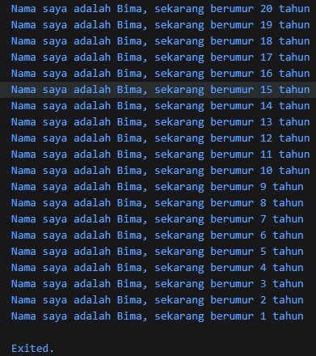

# Tugas Praktikum #02 | Pengantar Bahasa Pemrograman Dart - Bagian 1

## Identitas Mahasiswa

| Keterangan | Detail |
| :--- | :--- |
| **Nama** | Yosep Bima Aprillian |
| **NIM** | 244107060027 |
| **Kelas** | SIB-2D |

---

## Tugas Praktikum 2

### Soal 1: Modifikasi Kode

**Tugas:** Memodifikasi baris 3 agar mencetak keluaran sesuai dengan nama.

**Kode Dart:**

```dart
void main() {
  for (int i = 0; i < 10; i++) {
    print("Hello ${i + 2}");
  }
}
```

**Jawaban:**




---

### Soal 2

Mengapa sangat penting untuk memahami bahasa pemrograman Dart sebelum kita menggunakan framework Flutter? Jelaskan!

**Jawaban:**

Karena sintaks dan struktur logika yang digunakan pada Flutter merupakan Dart. Memahami Dart sangat penting karena:
- Flutter sepenuhnya ditulis dalam bahasa Dart
- Semua kode aplikasi Flutter menggunakan sintaks Dart
- Pemahaman Dart yang baik memudahkan pengembangan aplikasi Flutter
- Struktur logika dan konsep pemrograman Dart menjadi dasar dalam mengembangkan aplikasi Flutter

---

### Soal 3

Rangkumlah materi dari codelab ini menjadi poin-poin penting yang dapat Anda gunakan untuk membantu proses pengembangan aplikasi mobile menggunakan framework Flutter.

**Jawaban:**

- **Konsep Widget**: Segala hal di layar adalah Widget. Ada Stateless (tampilan tetap) dan Stateful (tampilan bisa berubah).

- **Sistem Layout**: Menggunakan Row (horizontal), Column (vertikal), dan Stack (tumpuk) untuk menyusun Widget.

- **State Management**: Menggunakan perintah `setState()` untuk memicu pembaruan layar saat data berubah.

- **Packages**: Memanfaatkan pustaka luar dari pub.dev untuk fitur tambahan tanpa harus membuat dari nol.

---

### Soal 4

Buatlah penjelasan dan contoh eksekusi kode tentang perbedaan Null Safety dan Late variabel!

**Jawaban:**

#### Null Safety
Aturan wajib dari Dart yang melarang variabel bernilai kosong (null) agar aplikasi tidak crash. Jika variabel memang butuh dibuat kosong, harus ditambahkan tanda tanya (?).

**Contoh:**
```dart
String? nama;  // Boleh null
String namaLengkap = "Yosep";  // Tidak boleh null
```

#### Late Variable
Digunakan saat kita punya variabel yang tidak boleh kosong, tapi kita menunda pengisian nilainya. Kita "berjanji" akan mengisinya nanti sebelum variabel tersebut dipakai.

**Contoh:**
```dart
late String deskripsi;

void main() {
  deskripsi = "Ini adalah contoh late variable";
  print(deskripsi);
}
```
