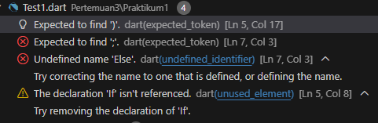
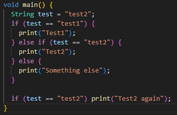
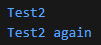

# #03 | Pengantar Bahasa Pemrograman Dart - Bagian 2

# Praktikum 1: Menerapkan Control Flows ("if/else")

## Identitas Mahasiswa

| Keterangan | Detail |
| :--- | :--- |
| **Nama** | Yosep Bima Aprillian |
| **NIM** | 244107060027 |
| **Kelas** | SIB-2D |

---

## Langkah 1:

Ketik atau salin kode program berikut ke dalam fungsi `main()`:

```dart
String test = "test2";
if (test == "test1") {
   print("Test1");
} else If (test == "test2") {
   print("Test2");
} Else {
   print("Something else");
}

if (test == "test2") print("Test2 again");
```

---

## Langkah 2:

Silakan coba eksekusi (Run) kode pada langkah 1 tersebut. Apa yang terjadi? Jelaskan!

### Hasil:



### Penjelasan:

Ketika kode dijalankan, terjadi **error** karena:

1. **`else If` dengan huruf kapital 'I'** - Dart case-sensitive, seharusnya `else if` (huruf kecil semua)
2. **`Else` dengan huruf kapital 'E'** - Seharusnya `else` (huruf kecil semua)

Dart sangat ketat terhadap penulisan syntax. Keyword seperti `if`, `else if`, dan `else` harus ditulis dengan huruf kecil semua.

### Kode yang Diperbaiki:



### Output Setelah Diperbaiki:
```



---

## Langkah 3:

Tambahkan kode program berikut, lalu coba eksekusi (Run) kode Anda:

```dart
String test = "true";
if (test) {
   print("Kebenaran");
}
```

### Apa yang terjadi?

**Catatan:** Jika kode di atas dijalankan **tanpa modifikasi**, akan terjadi **error**:

**Error:** `Conditions must have a static type of 'bool'`

### Penjelasan:

Dalam Dart, kondisi di dalam `if` statement harus berupa **boolean** (`true` atau `false`), bukan string. Variabel `test` bertipe `String`, sehingga tidak bisa langsung digunakan sebagai kondisi.

### Solusi yang Diterapkan:

Kode diperbaiki dengan melakukan perbandingan string:

```dart
String test2 = "true";
if (test2 == "true") {  // Membandingkan string dengan "true"
  print("Kebenaran");
}
```

### Hasil:

Kode ini **berhasil dijalankan tanpa error** karena:
- Menggunakan operator perbandingan `==` 
- Kondisi `test2 == "true"` menghasilkan nilai boolean (`true` atau `false`)
- Statement `if` menerima nilai boolean dari hasil perbandingan

### Output:
```
Kebenaran
```
