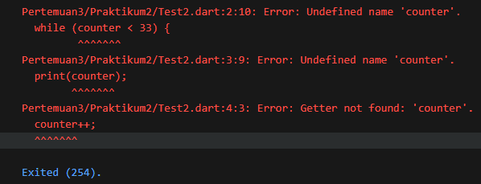
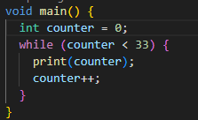
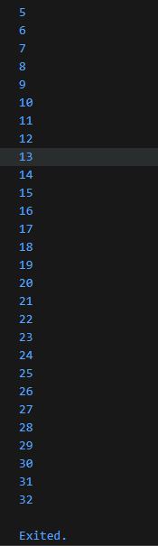
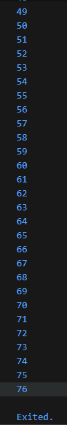

# #03 | Pengantar Bahasa Pemrograman Dart - Bagian 2

# Praktikum 2: Menerapkan Perulangan "while" dan "do-while"

## Identitas Mahasiswa

| Keterangan | Detail |
| :--- | :--- |
| **Nama** | Yosep Bima Aprillian |
| **NIM** | 244107060027 |
| **Kelas** | SIB-2D |

---

## Langkah 1: Membuat Kode Program While Loop

Ketik atau salin kode program berikut ke dalam fungsi `main()`:

```dart
while (counter < 33) {
  print(counter);
  counter++;
}
```

---

## Langkah 2: Eksekusi Kode dan Analisis Error

Silakan coba eksekusi (Run) kode pada langkah 1 tersebut. Apa yang terjadi? Jelaskan!

### Hasil:



### Penjelasan Error:

Ketika kode dijalankan, terjadi **error** karena:

**Error:** `Undefined name 'counter'`

**Penyebab:** Variabel `counter` tidak dideklarasikan sebelum digunakan dalam loop. Dart memerlukan semua variabel dideklarasikan terlebih dahulu sebelum dapat digunakan.

### Solusi:

Deklarasikan variabel `counter` sebelum menggunakan while loop:



### Output Setelah Diperbaiki:



### Penjelasan:

- **while loop** akan terus mengulang selama kondisi `counter < 33` bernilai `true`
- Pada setiap iterasi, nilai `counter` dicetak, lalu ditambah 1 dengan `counter++`
- Loop berhenti ketika `counter` mencapai 33 (karena kondisi 33 < 33 adalah false)

---

## Langkah 3: Menambahkan Do-While Loop

Tambahkan kode program berikut, lalu coba eksekusi (Run) kode Anda:

```dart
do {
  print(counter);
  counter++;
} while (counter < 77);
```

### Apa yang terjadi?

Kode berhasil dijalankan **tanpa error** dan mencetak nilai `counter` dari 33 hingga 76.

### Output:



