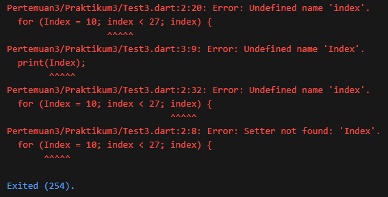
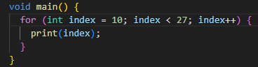
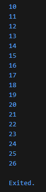
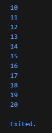

# #03 | Pengantar Bahasa Pemrograman Dart - Bagian 2

# Praktikum 3: Menerapkan Perulangan "for" dan "break-continue"

## Identitas Mahasiswa

| Keterangan | Detail |
| :--- | :--- |
| **Nama** | Yosep Bima Aprillian |
| **NIM** | 244107060027 |
| **Kelas** | SIB-2D |

---

## Langkah 1: Membuat Kode Program For Loop

Ketik atau salin kode program berikut ke dalam fungsi `main()`:

```dart
for (Index = 10; index < 27; index) {
  print(Index);
}
```

---

## Langkah 2: Eksekusi Kode dan Analisis Error

Silakan coba eksekusi (Run) kode pada langkah 1 tersebut. Apa yang terjadi? Jelaskan!

### Output:


### Penjelasan Error:

Ketika kode dijalankan, terjadi beberapa **error** karena:

**Error 1:** `Undefined name 'Index'` (pada `Index = 10`)
- **Penyebab:** Variabel `Index` (dengan huruf kapital 'I') tidak dideklarasikan sebelumnya

**Error 2:** `Undefined name 'Index'` (pada `print(Index)`)
- **Penyebab:** Inconsistensi penulisan - variabel ditulis `Index` tapi diakses sebagai `index` (huruf kecil), dan variabel tidak dideklarasikan

**Error 3:** `Infinite Loop` - Bahkan jika error di atas diperbaiki, loop akan berjalan infinite
- **Penyebab:** Bagian increment `index` pada for loop **tidak ada** (hanya tulis `index` tanpa `++`), sehingga nilai `index` tidak pernah berubah

### Solusi:




### Output:




### Penjelasan:
- **Inisialisasi:** `int index = 10` - Deklarasi dan inisialisasi variabel counter
- **Kondisi:** `index < 27` - Loop terus berjalan selama kondisi ini bernilai `true`
- **Increment:** `index++` - Menaikkan nilai index sebesar 1 setiap iterasi
- **Body:** Blok kode yang dijalankan setiap iterasi

---

## Langkah 3: Menambahkan Break dan Continue

Tambahkan kode program berikut di dalam for-loop, lalu coba eksekusi (Run) kode Anda:

```dart
If (Index == 21) break;
Else If (index > 1 || index < 7) continue;
print(index);
```

### Output:



### Penjelasan Output:

- Loop dimulai dari `index = 10` hingga `index < 27`
- Kondisi `else if (index > 1 && index < 7)` **tidak akan pernah terpenuhi** karena `index` dimulai dari 10
- Setiap iterasi dari 10 hingga 20 diprint
- Ketika `index == 21`, perintah `break` dijalankan dan loop langsung berhenti
