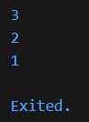
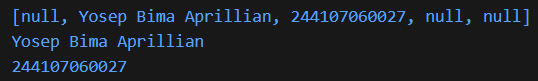

# #04 | Pengantar Bahasa Pemrograman Dart - Bagian 3

## Praktikum 1: Eksperimen Tipe Data List

## Identitas Mahasiswa

| Keterangan | Detail |
| :--- | :--- |
| **Nama** | Yosep Bima Aprillian |
| **NIM** | 244107060027 |
| **Kelas** | SIB-2D |

---

## Langkah 1

Ketik atau salin kode program berikut ke dalam fungsi `main()`:

```dart
var list = [1, 2, 3];
assert(list.length == 3);
assert(list[1] == 2);
print(list.length);
print(list[1]);

list[1] = 1;
assert(list[1] == 1);
print(list[1]);
```

## Langkah 2

Silakan coba eksekusi (Run) kode pada langkah 1 tersebut. Apa yang terjadi? Jelaskan!

### Hasil:



### Penjelasan:

- **`list.length == 3`** → List berisi 3 elemen, jadi assertion ini bernilai `true`.
- **`list[1] == 2`** → Nilai awal elemen pada index ke-1 adalah `2`, assertion ini bernilai `true`.
- **`list[1] = 1`** → Elemen pada index ke-1 diubah menjadi `1`.
- **`list[1] == 1`** → Setelah diubah, assertion ini juga bernilai `true`.
- **Kesimpulan:** Elemen pada list dapat diubah/dimodifikasi melalui index.

## Langkah 3

Ubah kode pada langkah 1 menjadi variabel final yang mempunyai index = 5 dengan default value = null. Isilah nama dan NIM Anda pada elemen index ke-1 dan ke-2. Lalu print dan capture hasilnya.

Apa yang terjadi ? Jika terjadi error, silakan perbaiki.

### Hasil:




### Penjelasan:

- **`List<dynamic>.filled(5, null, growable: false)`** → Membuat list dengan panjang tetap 5 elemen, semua bernilai `null` awal, dan tidak bisa bertambah.
- **`List<dynamic>`** → Menggunakan tipe `dynamic` agar bisa menampung berbagai tipe data (string, integer, dll).
- **`growable: false`** → List memiliki panjang tetap 5, tidak bisa ditambah atau dikurangi.
- **`final`** → Variabel `list` tidak bisa diarahkan ke list lain, tetapi isi elemennya tetap bisa diubah.
- **Index valid** → Index yang digunakan (`1` dan `2`) berada dalam rentang `0..4`, sehingga tidak ada error.