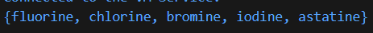
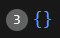
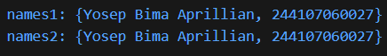

# #04 | Pengantar Bahasa Pemrograman Dart - Bagian 3

## Praktikum 2: Eksperimen Tipe Data Set

## Identitas Mahasiswa

| Keterangan | Detail |
| :--- | :--- |
| **Nama** | Yosep Bima Aprillian |
| **NIM** | 244107060027 |
| **Kelas** | SIB-2D |

---

## Langkah 1:

Ketik atau salin kode program berikut ke dalam fungsi `main()`.

```dart
var halogens = {'fluorine', 'chlorine', 'bromine', 'iodine', 'astatine'};
print(halogens);
```

## Langkah 2:

Silakan coba eksekusi (Run) kode pada langkah 1 tersebut. Apa yang terjadi? Jelaskan! Lalu perbaiki jika terjadi error.

### Hasil:



### Penjelasan:

- **`var halogens = {...}`** → Membuat **Set** (koleksi unik) yang berisi nama-nama elemen halogen.
- **Set vs List** → Perbedaan utama:
  - **Set** → Menggunakan kurung kurawal `{}`, menyimpan nilai **unik** (tidak ada duplikat), **tidak terurut berdasarkan index**.
  - **List** → Menggunakan kurung siku `[]`, menyimpan nilai **bisa duplikat**, **terurut berdasarkan index**.
- **Konten Set** → `{'fluorine', 'chlorine', 'bromine', 'iodine', 'astatine'}` berisi 5 elemen string yang semuanya unik.
- **`print(halogens)`** → Menampilkan seluruh isi Set dengan format `{element1, element2, ...}`.
- **Kesimpulan:** Set dalam Dart digunakan untuk menyimpan koleksi nilai unik tanpa duplikat dan tanpa urutan index tertentu.

## Langkah 3

Tambahkan kode program berikut, lalu coba eksekusi (Run) kode Anda.

```dart
var names1 = <String>{};
Set<String> names2 = {}; // This works, too.
var names3 = {}; // Creates a map, not a set.

print(names1);
print(names2);
print(names3);
```

Apa yang terjadi ? Jika terjadi error, silakan perbaiki namun tetap menggunakan ketiga variabel tersebut.

### Hasil:



### Penjelasan:

Kode berjalan tanpa error, namun hanya memberikan output seperti di screenshot

### Menambahkan Elemen

Tambahkan elemen nama dan NIM Anda pada kedua variabel Set tersebut dengan dua fungsi berbeda yaitu .add() dan .addAll(). Untuk variabel Map dihapus, nanti kita coba di praktikum selanjutnya.

```dart
  var names1 = <String>{};
  Set<String> names2 = {};

  names1.add("Yosep Bima Aprillian");
  names1.add("244107060027");

  names2.addAll({"Yosep Bima Aprillian", "244107060027"});

  print("names1: $names1");
  print("names2: $names2");
  ```

### Hasil:



### Penjelasan:

- **`var names1 = <String>{}`** → Membuat Set kosong dengan tipe eksplisit `String` menggunakan type hint `<String>{}`. Type hint diperlukan agar Dart tahu ini adalah Set, bukan Map.
- **`Set<String> names2 = {}`** → Membuat Set kosong dengan deklarasi tipe eksplisit `Set<String>`. Dengan deklarasi tipe di depan, Dart langsung tahu ini adalah Set meskipun `{}` kosong.
- **`names1.add("Yosep Bima Aprillian")`** → Menambahkan **satu elemen** ke Set `names1` menggunakan method `.add()`.
- **`names1.add("244107060027")`** → Menambahkan **elemen kedua** ke Set `names1` menggunakan method `.add()`.
- **`names2.addAll({...})`** → Menambahkan **multiple elemen sekaligus** ke Set `names2` menggunakan method `.addAll()` dengan parameter berupa Set.

### Perbedaan Method:

- **`.add(element)`** → Menambahkan **satu elemen tunggal** ke Set
- **`.addAll(iterable)`** → Menambahkan **beberapa elemen sekaligus** dari Set atau List lain
- **Output yang sama** → Kedua variabel `names1` dan `names2` memiliki isi yang identik karena menyimpan elemen-elemen yang sama.
- **Set menjaga keunikan** → Jika ada elemen duplikat, Set otomatis mengabaikannya.

### Kesimpulan:

- Saat membuat Set dengan `{}`, **harus ada type hint** atau **deklarasi tipe eksplisit** agar Dart tidak mengira sebagai Map.
- Method `.add()` optimal untuk menambahkan satu elemen.
- Method `.addAll()` lebih efisien untuk menambahkan multiple elemen sekaligus.
