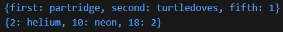
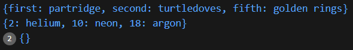
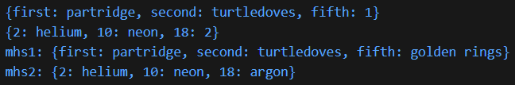
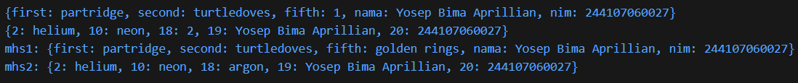

# #04 | Pengantar Bahasa Pemrograman Dart - Bagian 3

## Praktikum 3: Eksperimen Tipe Data Maps

## Identitas Mahasiswa

| Keterangan | Detail |
| :--- | :--- |
| **Nama** | Yosep Bima Aprillian |
| **NIM** | 244107060027 |
| **Kelas** | SIB-2D |

---

## Langkah 1:

Ketik atau salin kode program berikut ke dalam fungsi main().

```dart
var gifts = {
  // Key:    Value
  'first': 'partridge',
  'second': 'turtledoves',
  'fifth': 1
};

var nobleGases = {
  2: 'helium',
  10: 'neon',
  18: 2,
};

print(gifts);
print(nobleGases);
```

## Langkah 2:

Silakan coba eksekusi (Run) kode pada langkah 1 tersebut. Apa yang terjadi? Jelaskan! Lalu perbaiki jika terjadi error.

### Hasil



### Penjelasan:

- **`var gifts = {...}`** → Membuat **Map** (koleksi pasangan key-value) dengan tipe inferensi otomatis menjadi `Map<String, dynamic>`.
- **Key dan Value dalam Map:**
  - **Key** → Kunci unik untuk mengakses value (dalam `gifts` menggunakan String)
  - **Value** → Nilai yang tersimpan di setiap key (dalam `gifts` bisa String atau int)
- **Perbedaan Map dan Set/List:**
  - **Set** → `{element1, element2}` - Koleksi nilai unik
  - **Map** → `{key: value, key: value}` - Koleksi pasangan key-value
  - **List** → `[element1, element2]` - Koleksi urut dengan index
- **`gifts = {first: partridge, ...}`** → Map dengan key String dan value berisi nama burung.
- **`nobleGases = {2: helium, ...}`** → Map dengan key int dan value berisi nama gas mulia.
- **Akses Map** → Berbeda dengan List menggunakan index, Map mengakses value melalui key: `gifts['first']` akan mengembalikan `'partridge'`.
- **Kesimpulan:** Map dalam Dart digunakan untuk menyimpan pasangan key-value, memudahkan akses data berdasarkan key spesifik.

---

## Langkah 3:

Tambahkan kode program berikut, lalu coba eksekusi (Run) kode Anda.

```dart
var mhs1 = Map<String, String>();
gifts['first'] = 'partridge';
gifts['second'] = 'turtledoves';
gifts['fifth'] = 'golden rings';

var mhs2 = Map<int, String>();
nobleGases[2] = 'helium';
nobleGases[10] = 'neon';
nobleGases[18] = 'argon';
```

Apa yang terjadi ? Jika terjadi error, silakan perbaiki.

### Hasil:



### Penjelasan:

Kode berjalan tanpa error, namun hanya memberikan output seperti di screenshot karena variabel mhs1 dan mhs2 sama sekali tidak pernah diisi data setelah dibuat.

### Perbaikan

```dart
void main(List<String> args) {
  var gifts = {
    'first': 'partridge',
    'second': 'turtledoves',
    'fifth': 1
  };

  var nobleGases = {
    2: 'helium',
    10: 'neon',
    18: 2,
  };

  var mhs1 = Map<String, String>();
  mhs1['first'] = 'partridge';
  mhs1['second'] = 'turtledoves';
  mhs1['fifth'] = 'golden rings';

  var mhs2 = Map<int, String>();
  mhs2[2] = 'helium';
  mhs2[10] = 'neon';
  mhs2[18] = 'argon';

  print(gifts);
  print(nobleGases);
  print("mhs1: $mhs1");
  print("mhs2: $mhs2");
}
```

### Hasil




### Menambahkan Elemen

Tambahkan elemen nama dan NIM Anda pada tiap variabel di atas (gifts, nobleGases, mhs1, dan mhs2).

```dart
void main(List<String> args) {
  var gifts = {
    'first': 'partridge',
    'second': 'turtledoves',
    'fifth': 1,
    'nama': 'Yosep Bima Aprillian',
    'nim': '244107060027'
  };

  var nobleGases = {
    2: 'helium',
    10: 'neon',
    18: 2,
    19: 'Yosep Bima Aprillian',
    20: '244107060027'
  };

  var mhs1 = Map<String, String>();
  mhs1['first'] = 'partridge';
  mhs1['second'] = 'turtledoves';
  mhs1['fifth'] = 'golden rings';
  mhs1['nama'] = 'Yosep Bima Aprillian';
  mhs1['nim'] = '244107060027';

  var mhs2 = Map<int, String>();
  mhs2[2] = 'helium';
  mhs2[10] = 'neon';
  mhs2[18] = 'argon';
  mhs2[19] = 'Yosep Bima Aprillian';
  mhs2[20] = '244107060027';

  print(gifts);
  print(nobleGases);
  print("mhs1: $mhs1");
  print("mhs2: $mhs2");
}
```

#### Hasil:



#### Penjelasan:

##### 1. Map `gifts` (String Key - Dynamic Value):

```dart
var gifts = {
  'first': 'partridge',
  'second': 'turtledoves',
  'fifth': 1,
  'nama': 'Yosep Bima Aprillian',
  'nim': '244107060027'
};
```

- **Tipe:** `Map<String, dynamic>` (key String, value bisa String atau int)
- **Key baru** `'nama'` dan `'nim'` ditambahkan di dalam literal Map
- **Value bercampur:** Key `'fifth'` bernilai `1` (int), sementara key lain bernilai String
- **Mixed type value** memungkinkan karena tipe value adalah `dynamic`

##### 2. Map `nobleGases` (Int Key - Dynamic Value):

```dart
var nobleGases = {
  2: 'helium',
  10: 'neon',
  18: 2,
  19: 'Yosep Bima Aprillian',
  20: '244107060027'
};
```

- **Tipe:** `Map<int, dynamic>` (key int, value bisa String atau int)
- **Key numerik** `19` dan `20` ditambahkan untuk menyimpan nama dan NIM
- **Value bercampur:** Key `18` bernilai `2` (int), sementara key baru bernilai String
- **Akses** menggunakan key int: `nobleGases[19]` mengembalikan `'Yosep Bima Aprillian'`

##### 3. Map `mhs1` (String Key - String Value):

```dart
var mhs1 = Map<String, String>();
mhs1['first'] = 'partridge';
mhs1['second'] = 'turtledoves';
mhs1['fifth'] = 'golden rings';
mhs1['nama'] = 'Yosep Bima Aprillian';
mhs1['nim'] = '244107060027';
```

- **Tipe:** `Map<String, String>` (key dan value harus String)
- **Inisialisasi:** Menggunakan konstruktor `Map<String, String>()` (kosong di awal)
- **Menambah elemen one-by-one** menggunakan bracket notation: `mhs1[key] = value`
- **Semua value String:** Karena tipe ditentukan `String`, tidak bisa menampung int
- **Key `'nama'` dan `'nim'`** ditambahkan untuk menyimpan data mahasiswa

##### 4. Map `mhs2` (Int Key - String Value):

```dart
var mhs2 = Map<int, String>();
mhs2[2] = 'helium';
mhs2[10] = 'neon';
mhs2[18] = 'argon';
mhs2[19] = 'Yosep Bima Aprillian';
mhs2[20] = '244107060027';
```

- **Tipe:** `Map<int, String>` (key int, value String)
- **Inisialisasi:** Menggunakan konstruktor `Map<int, String>()` (kosong di awal)
- **Menambah elemen one-by-one** menggunakan bracket notation: `mhs2[key] = value`
- **Semua value String:** Key `18` diubah menjadi `'argon'` (sebelumnya `2`)
- **Key numerik** `19` dan `20` digunakan untuk menyimpan nama dan NIM

#### Kesimpulan:

- **Map literal** `{...}` cocok untuk data yang sudah diketahui dari awal dan bisa menerima mixed type value.
- **Map konstruktor** `Map<K, V>()` cocok untuk data dinamis dan memerlukan type safety yang ketat.
- **Elemen baru** bisa ditambahkan baik ke Map literal maupun konstruktor dengan bracket notation.
- **Key unik:** Jika ada key yang sama, value lama akan ditimpa oleh value baru.
- **Mixed type value** hanya bisa dilakukan jika tipe value adalah `dynamic`.


