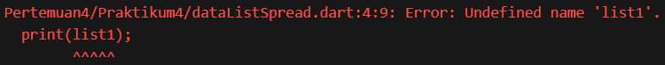
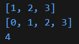
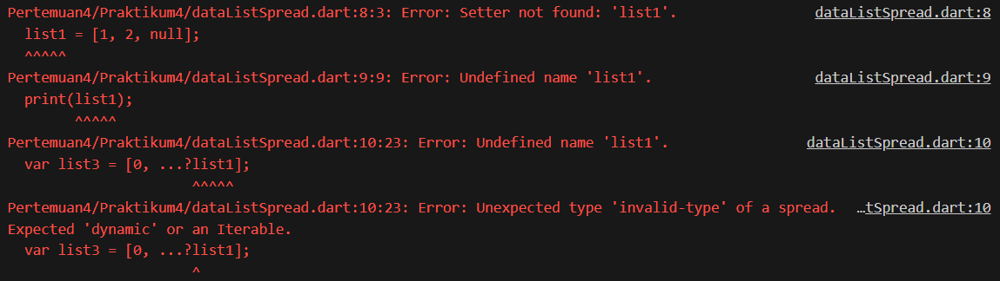
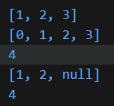
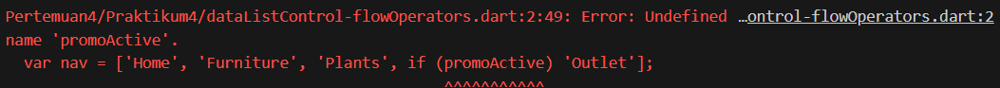
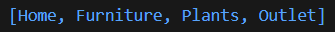
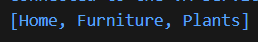
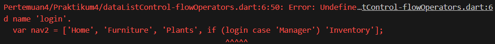
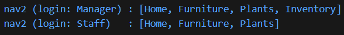
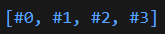

# #04 | Pengantar Bahasa Pemrograman Dart - Bagian 3

## Praktikum 4: Eksperimen Tipe Data List: Spread dan Control-flow Operators

## Identitas Mahasiswa

| Keterangan | Detail |
| :--- | :--- |
| **Nama** | Yosep Bima Aprillian |
| **NIM** | 244107060027 |
| **Kelas** | SIB-2D |

---

## Langkah 1:

Ketik atau salin kode program berikut ke dalam fungsi `main()`.

```dart
var list = [1, 2, 3];
var list2 = [0, ...list];
print(list1);
print(list2);
print(list2.length);
```

## Langkah 2:

Silakan coba eksekusi (Run) kode pada langkah 1 tersebut. Apa yang terjadi? Jelaskan! Lalu perbaiki jika terjadi error.

### Hasil



### Penjelasan:

Variabel list1 belum pernah dibuat atau dideklarasikan sebelumnya. Pada baris pertama kode, Anda mendeklarasikan variabel dengan nama list, bukan list1.

### Perbaikan
```dart
void main() {
  var list = [1, 2, 3];
  var list2 = [0, ...list];
  print(list);
  print(list2);
  print(list2.length);
}
```

### Hasil



## Langkah 3:

Tambahkan kode program berikut, lalu coba eksekusi (Run) kode Anda.

```dart
list1 = [1, 2, null];
print(list1);
var list3 = [0, ...?list1];
print(list3.length);
```

Apa yang terjadi ? Jika terjadi error, silakan perbaiki.

### Hasil



### Perbaikan

```dart
void main() {
  var list = [1, 2, 3];
  var list2 = [0, ...list];
  print(list);
  print(list2);
  print(list2.length);

  var list1 = [1, 2, null];
  print(list1);
  var list3 = [0, ...?list1];
  print(list3.length);
}
```
### Hasil



### Menambahkan Variable

Tambahkan variabel list berisi NIM Anda menggunakan Spread Operators. Dokumentasikan hasilnya dan buat laporannya!

```dart
void main() {
  var list = [1, 2, 3];
  var list2 = [0, ...list];
  print(list);
  print(list2);
  print(list2.length);

  var list1 = [1, 2, null];
  print(list1);
  var list3 = [0, ...?list1];
  print(list3.length);

  var nimList = ['244107060027'];
  
  var listDenganNim = [...list3, ...nimList]; 
  
  print('List setelah ditambah NIM: $listDenganNim');
  print('Panjang list akhir: ${listDenganNim.length}');
}
```

#### Kesimpulan:

- **Deklarasi Variabel NIM:** Variabel baru nimList dibuat dengan tipe List yang menampung satu elemen data berupa teks (String), yaitu NIM ['244107060027'].
- **Penggunaan Spread Operator (...):** Variabel listDenganNim dibuat untuk menampung gabungan data. Di dalamnya, kita memanggil ...list3 untuk mengekstrak seluruh isi array dari list3, lalu memanggil ...nimList untuk mengekstrak isi dari nimList.
- **Hasil Akhir:** Spread Operator secara efektif meleburkan kedua koleksi tersebut menjadi satu list utuh yang baru, menyederhanakan proses penggabungan data tanpa perlu menggunakan looping manual.

## Langkah 4:

Tambahkan kode program berikut, lalu coba eksekusi (Run) kode Anda.

```dart
var nav = ['Home', 'Furniture', 'Plants', if (promoActive) 'Outlet'];
print(nav);
```

Apa yang terjadi ? Jika terjadi error, silakan perbaiki. Tunjukkan hasilnya jika variabel promoActive ketika true dan false.

#### Hasil:



#### Penjelasan:

Perlu untuk mendeklarasikan variabel promoActive terlebih dahulu.

### Perbaikan

```dart
void main() {
  var promoActive = true;
  var nav = ['Home', 'Furniture', 'Plants', if (promoActive) 'Outlet'];
  print(nav);
}
```

#### Hasil(promoActive True):



#### Hasil(promoActive False):



## Langkah 5:

Tambahkan kode program berikut, lalu coba eksekusi (Run) kode Anda.

```dart
var nav2 = ['Home', 'Furniture', 'Plants', if (login case 'Manager') 'Inventory'];
print(nav2);
```

Apa yang terjadi ? Jika terjadi error, silakan perbaiki. Tunjukkan hasilnya jika variabel login mempunyai kondisi lain.

#### Hasil:



#### Penjelasan:

Perlu untuk mendeklarasikan dan memberi nilai variabel login terlebih dahulu.

### Perbaikan

```dart
void main() {
  String login = 'Manager';
  var nav2Manager = ['Home', 'Furniture', 'Plants', if (login case 'Manager') 'Inventory'];
  print('nav2 (login: Manager) : $nav2Manager');

  login = 'Staff';
  var nav2Staff = ['Home', 'Furniture', 'Plants', if (login case 'Manager') 'Inventory'];
  print('nav2 (login: Staff)   : $nav2Staff');
}
```

#### Hasil:



## Langkah 6:

Tambahkan kode program berikut, lalu coba eksekusi (Run) kode Anda.

```dart
var listOfInts = [1, 2, 3];
var listOfStrings = ['#0', for (var i in listOfInts) '#$i'];
assert(listOfStrings[1] == '#1');
print(listOfStrings);
```

Apa yang terjadi ? Jika terjadi error, silakan perbaiki. Jelaskan manfaat Collection For dan dokumentasikan hasilnya.

#### Hasil:



#### Manfaat Collection For:

Fitur Collection For sangat bermanfaat karena memungkinkan kita untuk membuat, memanipulasi, dan memasukkan elemen ke dalam sebuah Collection (seperti List) secara dinamis menggunakan perulangan for, langsung di dalam deklarasi list tersebut.

Hal ini membuat kode menjadi jauh lebih ringkas, bersih, dan efisien dibandingkan jika kita harus membuat list kosong terlebih dahulu, lalu menggunakan fungsi .add() di dalam blok perulangan for secara terpisah.

