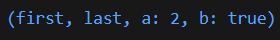
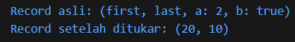
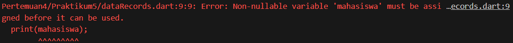
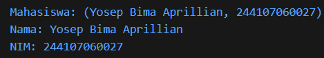
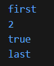
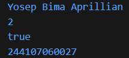

# #04 | Pengantar Bahasa Pemrograman Dart - Bagian 3

## Praktikum 5: Eksperimen Tipe Data Records

## Identitas Mahasiswa

| Keterangan | Detail |
| :--- | :--- |
| **Nama** | Yosep Bima Aprillian |
| **NIM** | 244107060027 |
| **Kelas** | SIB-2D |

---

## Langkah 1:

Ketik atau salin kode program berikut ke dalam fungsi `main()`.

```dart
  var record = ('first', a: 2, b: true, 'last');
  print(record);
```

## Langkah 2:

Silakan coba eksekusi (Run) kode pada langkah 1 tersebut. Apa yang terjadi? Jelaskan! Lalu perbaiki jika terjadi error.

### Hasil



#### Penjelasan:

Kode berjalan **tanpa error**. Record dalam Dart adalah tipe data yang memungkinkan penyimpanan multiple values dalam satu variabel dengan kombinasi positional fields dan named fields. Dalam contoh ini, `'first'` dan `'last'` merupakan positional fields yang dapat diakses menggunakan indeks numerik `$1` dan `$2`, sementara `a: 2` dan `b: true` merupakan named fields yang diakses langsung menggunakan nama fieldnya. Output yang ditampilkan adalah `(first, a: 2, b: true, last)`, menunjukkan bahwa record dapat menggabungkan kedua jenis fields tersebut dalam struktur data tunggal.

## Langkah 3:

Tambahkan kode program berikut di luar scope `void main()`, lalu coba eksekusi (Run) kode Anda.

```dart
(int, int) tukar((int, int) record) {
  var (a, b) = record;
  return (b, a);
}
```

Apa yang terjadi ? Jika terjadi error, silakan perbaiki. Gunakan fungsi `tukar()` di dalam `main()` sehingga tampak jelas proses pertukaran value field di dalam Records.

#### Penjelasan:

Kode **tidak akan error** saat dijalankan, tetapi **fungsi `tukar()` belum dipanggil**, sehingga tidak ada proses pertukaran yang terlihat.

### Kode Perbaikan:

```dart
void main() {
  var record = ('first', a: 2, b: true, 'last');
  print("Record asli: $record");

  var recordTukar = tukar((10, 20));
  print("Record setelah ditukar: $recordTukar");
}

(int, int) tukar((int, int) record) {
  var (a, b) = record;
  return (b, a);
}
```

### Hasil



## Langkah 4:

Tambahkan kode program berikut di dalam scope `void main()`, lalu coba eksekusi (Run) kode Anda.

```dart
// Record type annotation in a variable declaration:
(String, int) mahasiswa;
print(mahasiswa)
```

Apa yang terjadi ? Jika terjadi error, silakan perbaiki. Inisialisasi field nama dan NIM Anda pada variabel record `mahasiswa` di atas. Dokumentasikan hasilnya dan buat laporannya!

### Hasil



### Kode Perbaikan:

```dart
  (String, int) mahasiswa = ('Yosep Bima Aprillian', 244107060027);
  print(mahasiswa);
  
  // Atau akses field individual:
  print("Nama: ${mahasiswa.$1}");
  print("NIM: ${mahasiswa.$2}");
```

### Hasil



## Langkah 5:

Tambahkan kode program berikut di dalam scope void main(), lalu coba eksekusi (Run) kode Anda.

```dart
var mahasiswa2 = ('first', a: 2, b: true, 'last');

print(mahasiswa2.$1); // Prints 'first'
print(mahasiswa2.a); // Prints 2
print(mahasiswa2.b); // Prints true
print(mahasiswa2.$2); // Prints 'last'
```

Apa yang terjadi ? Jika terjadi error, silakan perbaiki.

### Hasil



### Mengantikan isi record
Gantilah salah satu isi record dengan nama dan NIM Anda, lalu dokumentasikan hasilnya dan buat laporannya!

### Kode Perbaikan:

```dart
  var mahasiswa2 = ('Yosep Bima Aprillian', a: 2, b: true, 244107060027);

  print(mahasiswa2.$1);
  print(mahasiswa2.a);
  print(mahasiswa2.b);
  print(mahasiswa2.$2);
```

### Hasil



#### Kesimpulan:

Record dalam Dart memungkinkan fleksibilitas dalam mengakses data dengan dua cara: positional fields menggunakan notasi $n (dimana n adalah urutan field) dan named fields menggunakan notasi dot notation (.fieldName). Hal ini membuat record sangat berguna untuk mengembalikan multiple values dari fungsi atau menyimpan data terstruktur dengan cara yang jelas dan mudah dibaca.

