# #05 | Aplikasi Pertama dan Widget Dasar Flutter

## Tugas Praktikum

## Identitas Mahasiswa

| Keterangan | Detail |
| :--- | :--- |
| **Nama** | Yosep Bima Aprillian |
| **NIM** | 244107060027 |
| **Kelas** | SIB-2D |

---

## Laporan Codelabs: Your First Flutter app

## Mengubah file pubspec.yaml menjadi:

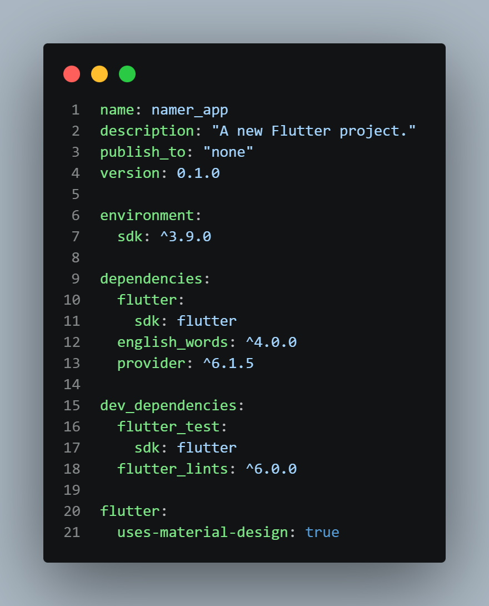

## Mengubah file analysis_option.yaml menjadi:

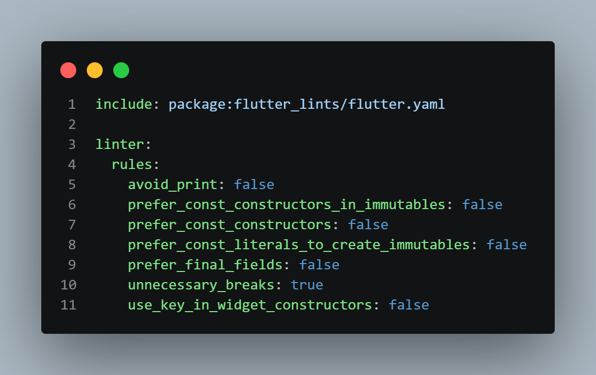

## Mengubah file main.dart menjadi:

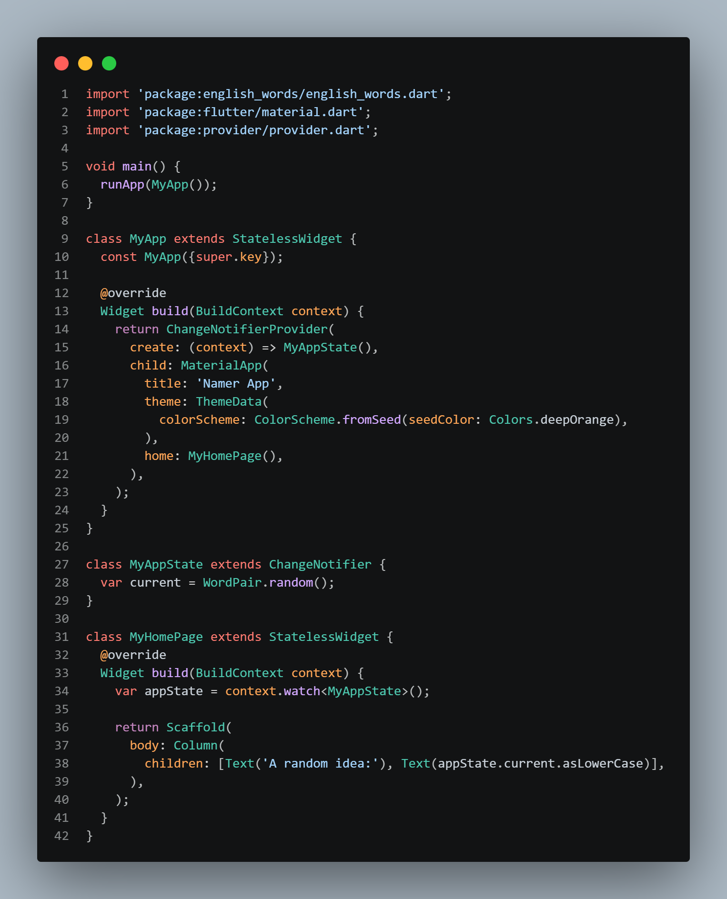

### Hasilnya:

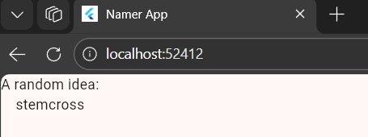

## Menambahkan teks pada file main.dart:

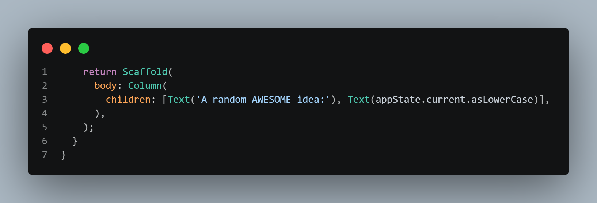

### Hasilnya:

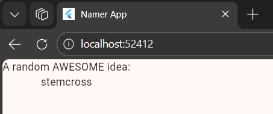

## Menambahkan Button:

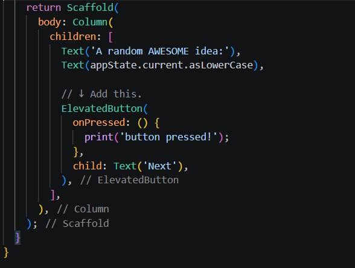

### Hasilnya:

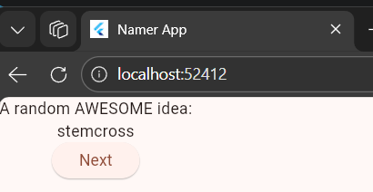

## Menambahkan behavior pada Button:

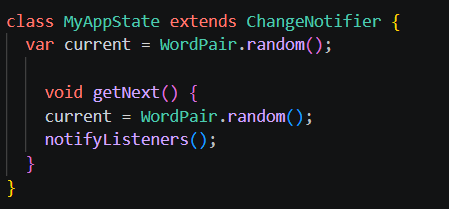
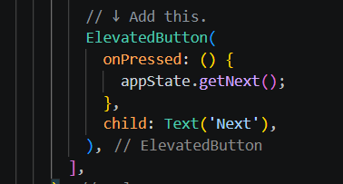

### Hasilnya:
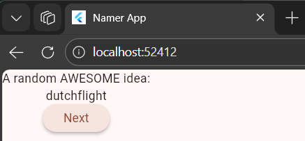
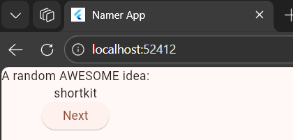

## Menambahkan Big Card:

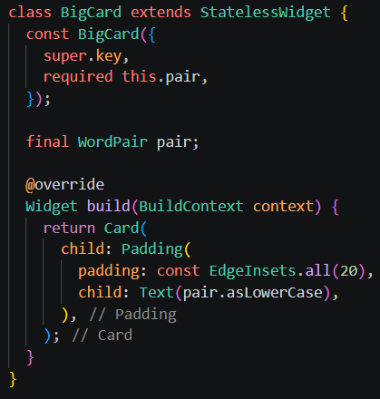

### Hasilnya:
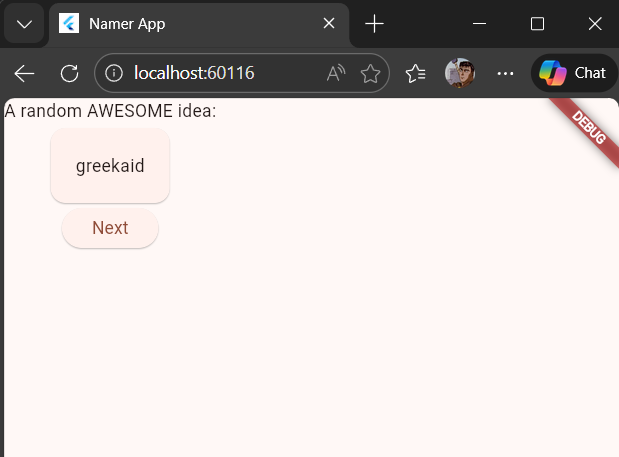

## Menambahkan Theme dan Style:

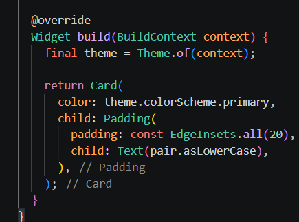

### Hasilnya:
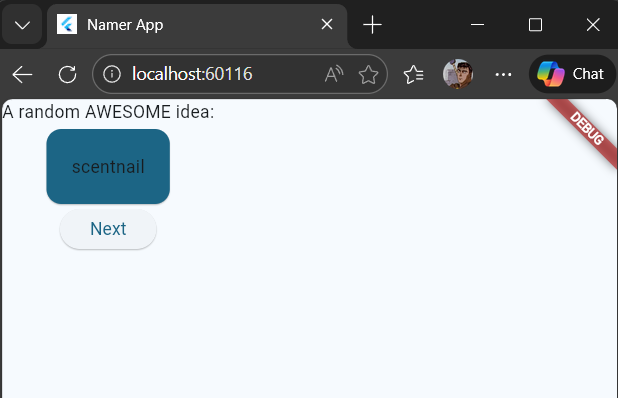

## Menambahkan TextTheme:

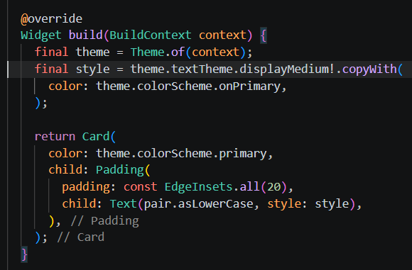

### Hasilnya:
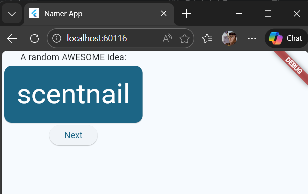

## Menaruh Page ke tengah:

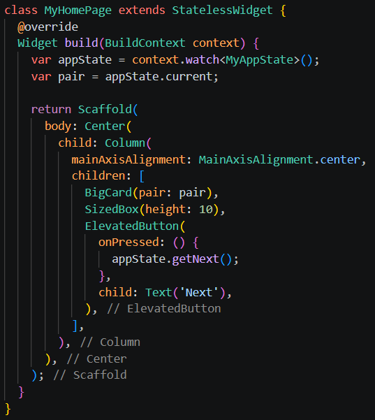

### Hasilnya:
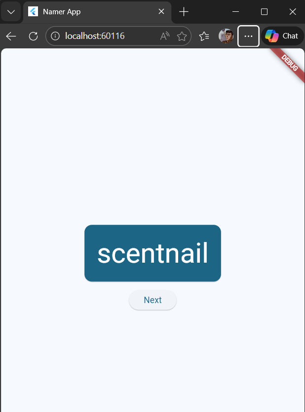

## Menambahkan Like Button:

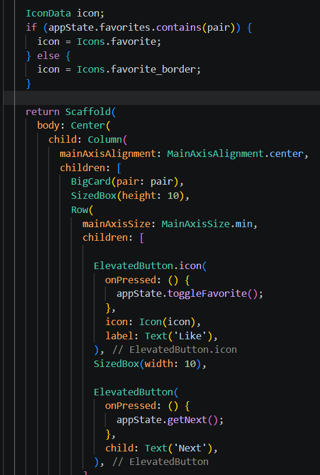

### Hasilnya:
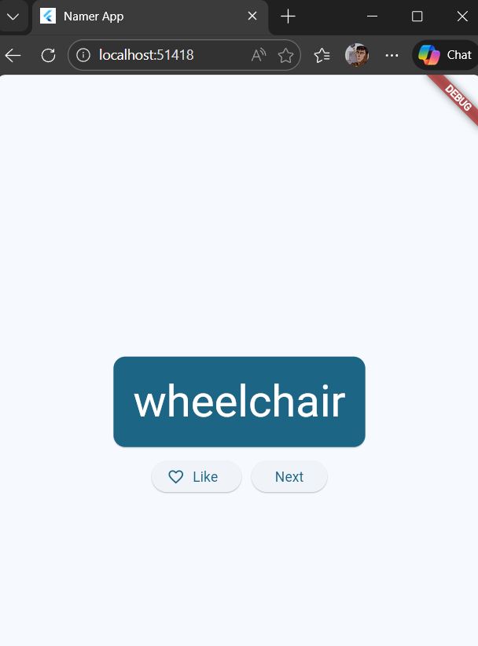

## Menambahkan Navigation Rail:

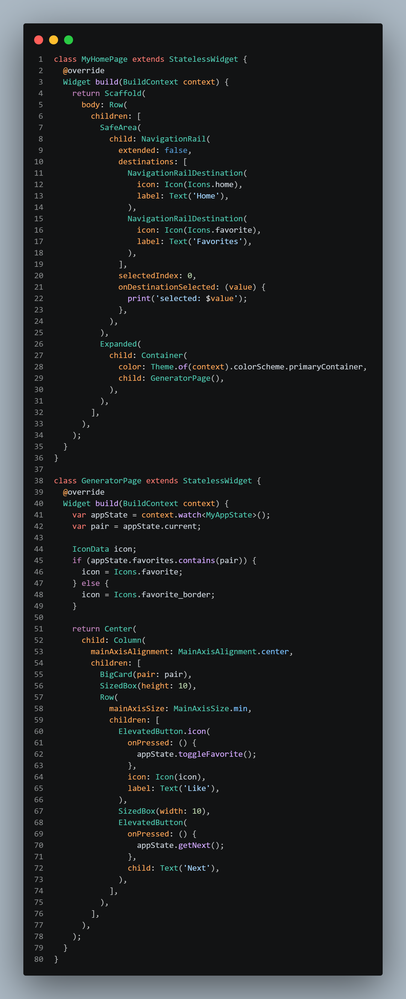

### Hasilnya:
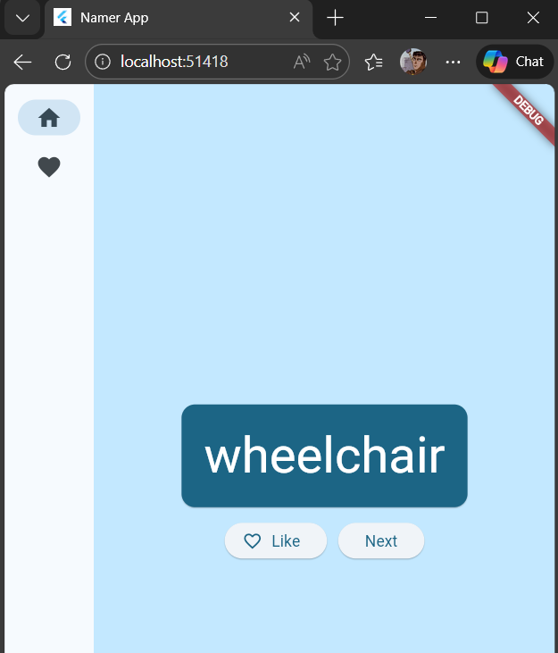

## Menambahkan Responsiveness pada Navigation Rail:

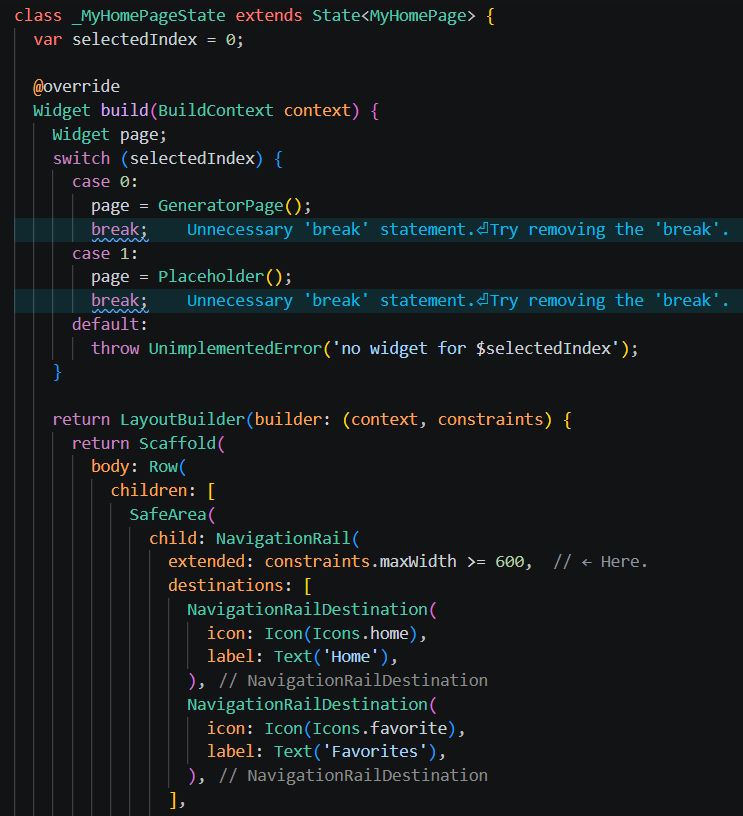

### Hasilnya:
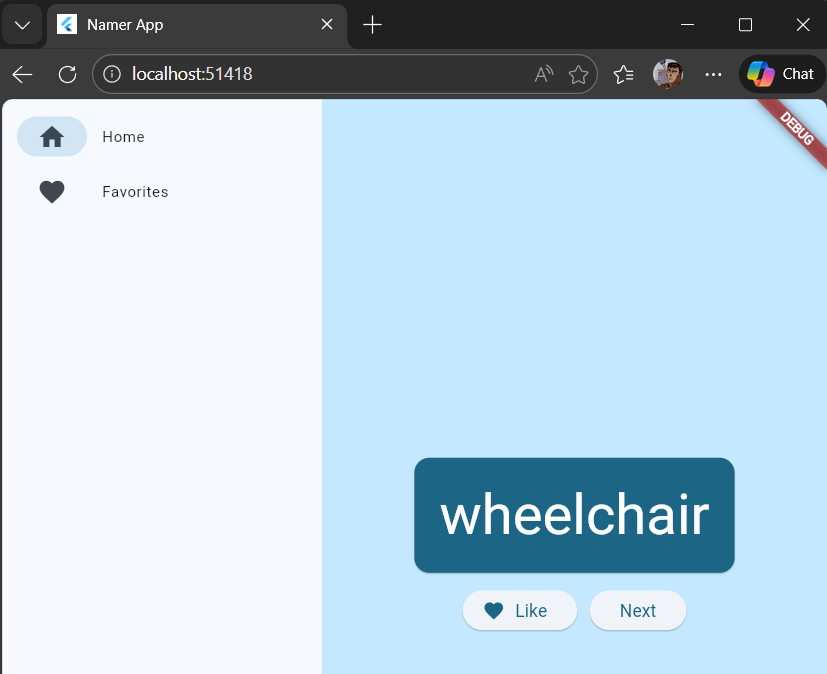

## Menambahkan Tab Favorite:

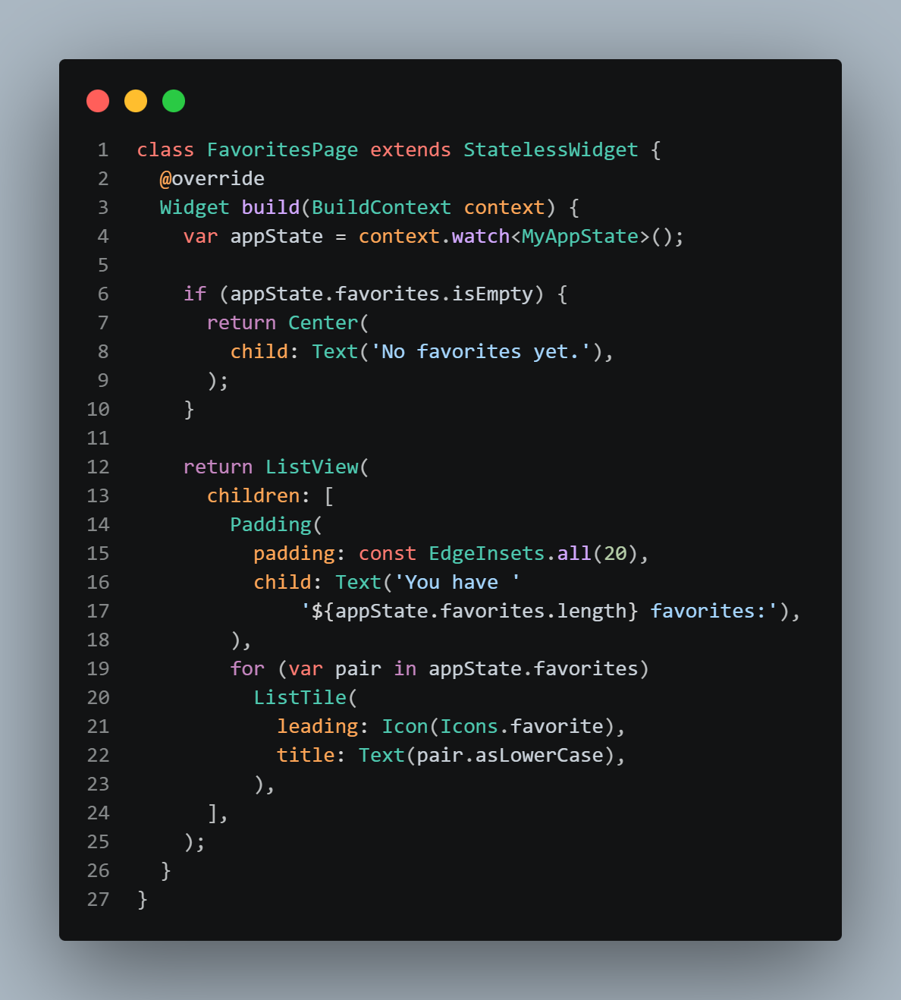

### Hasilnya:
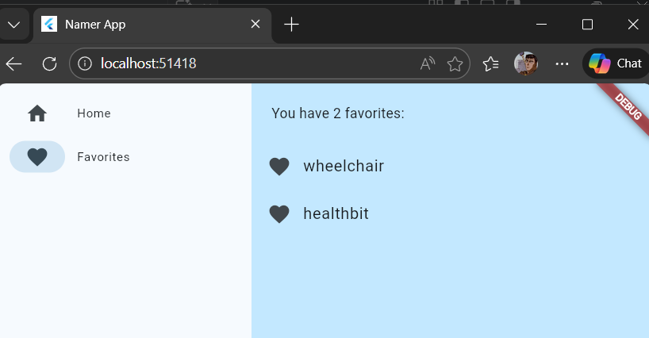

