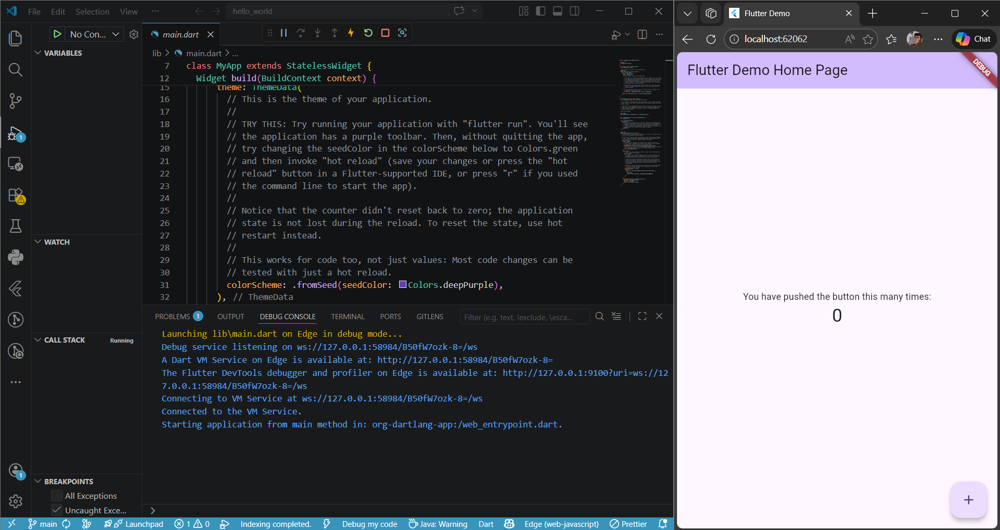
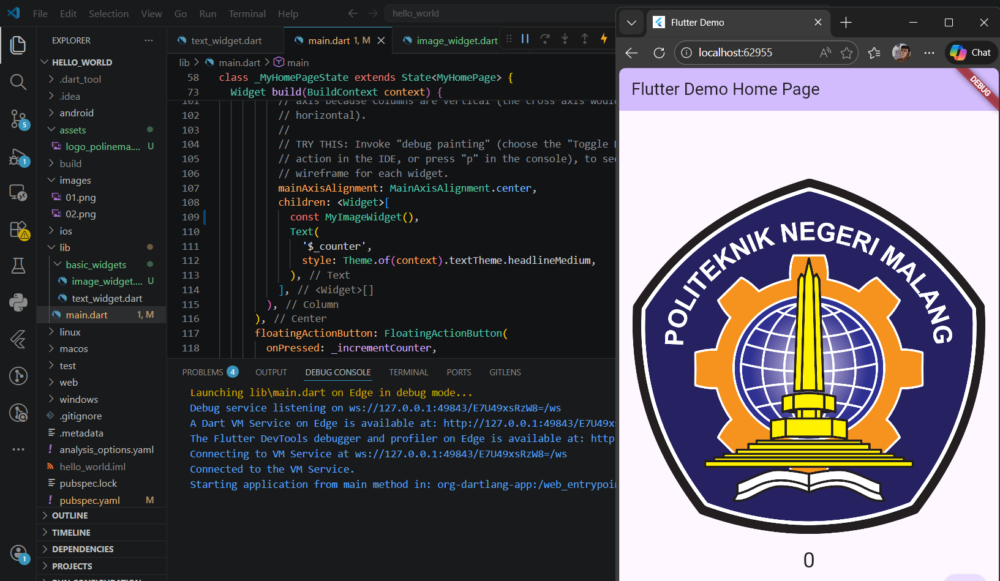
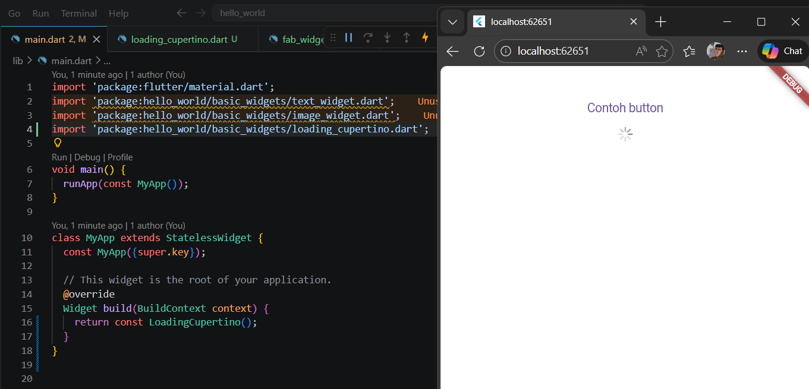
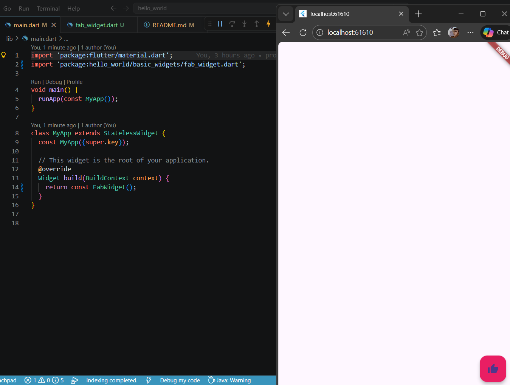
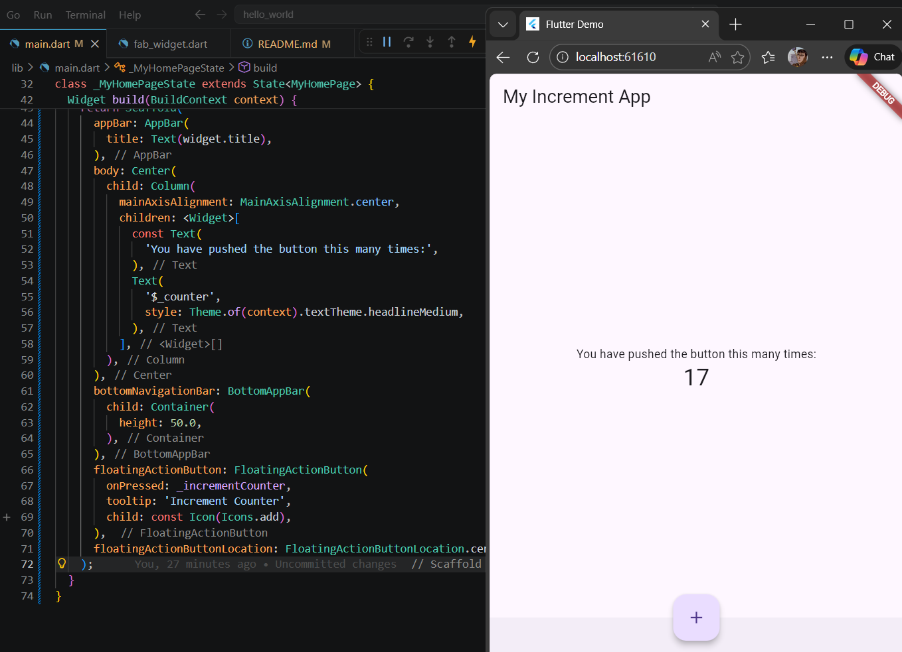
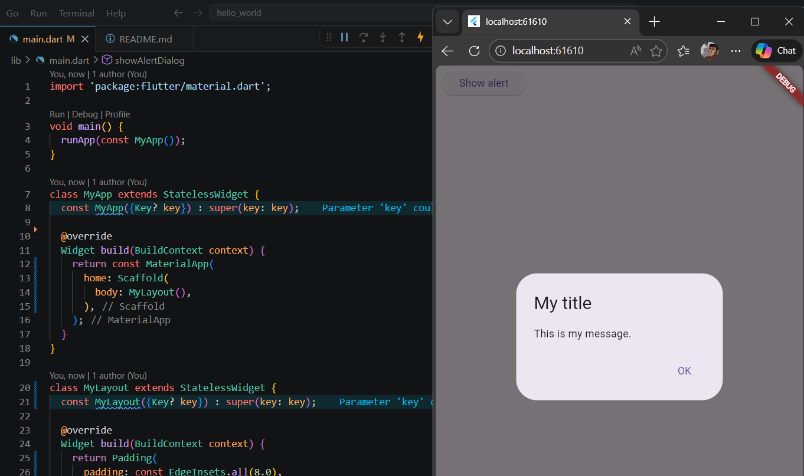
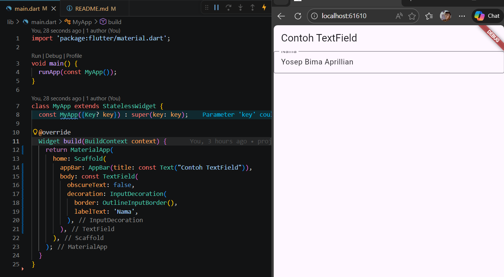
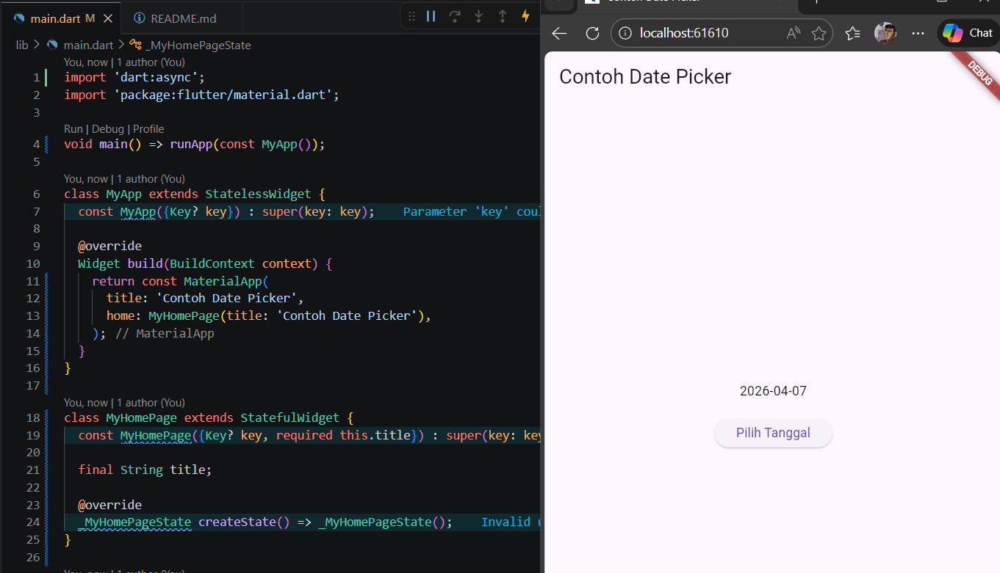
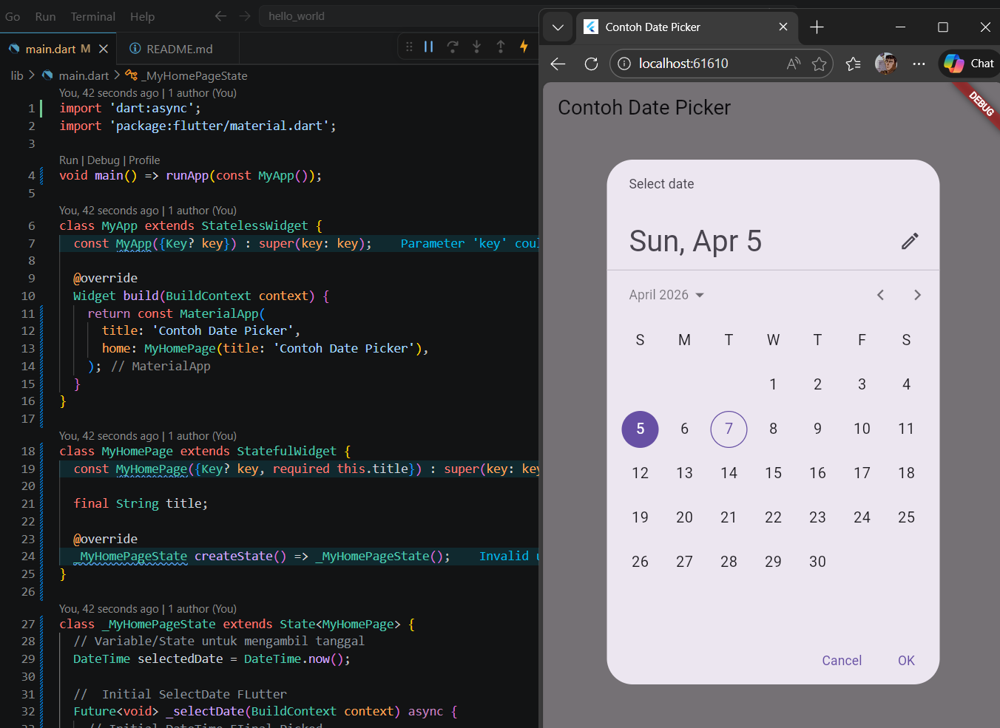

# Yosep Bima Aprillian

A new Flutter project.

## Praktikum 4: Menerapkan Widget Dasar

### Hasil Langkah 1:

### Hasil Langkah 2:

## Praktikum 5: Menerapkan Widget Material Design dan iOS Cupertino

### Hasil Langkah 1:

### Hasil Langkah 2:

### Hasil Langkah 3:

### Hasil Langkah 4:

### Hasil Langkah 5:

### Hasil Langkah 6:

