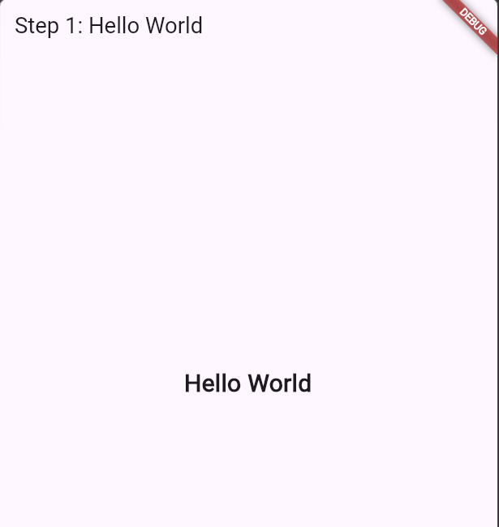
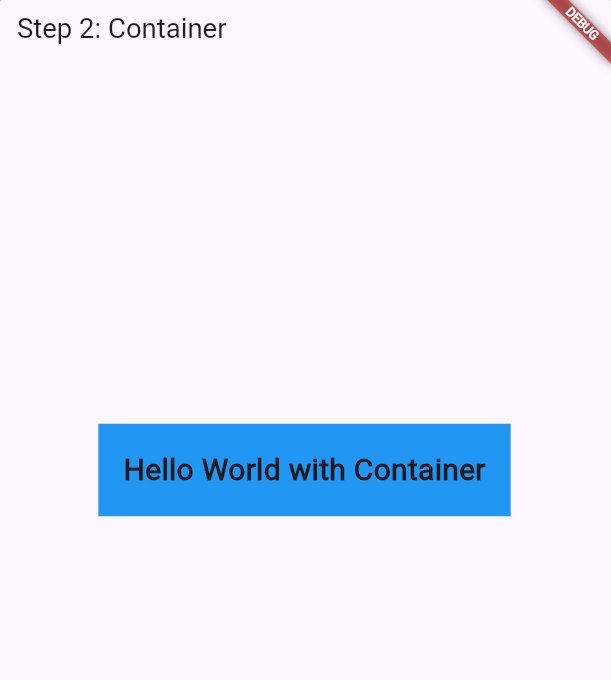
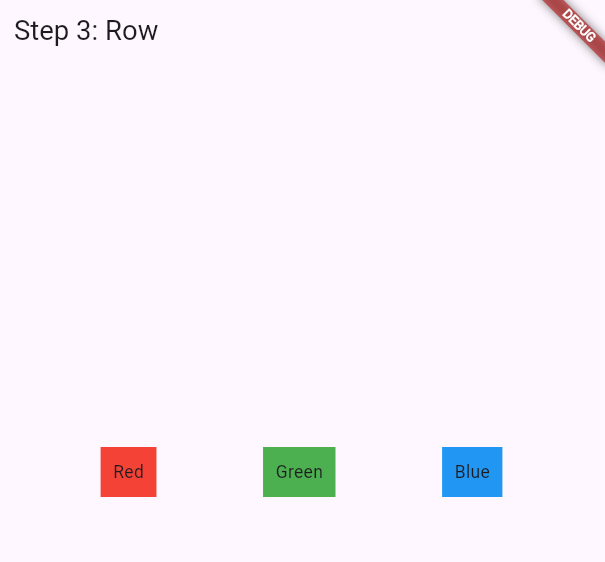
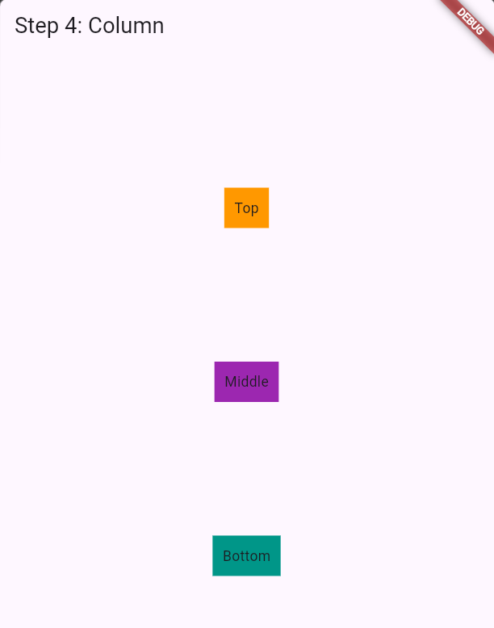
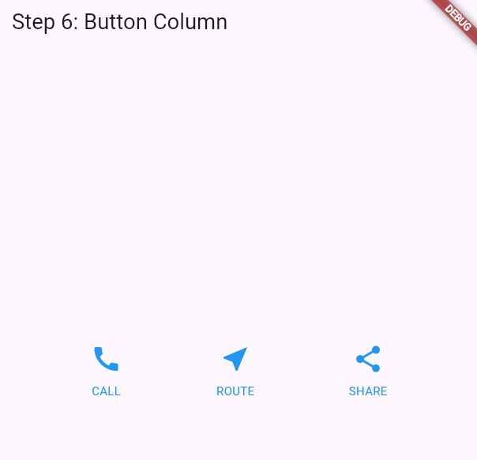
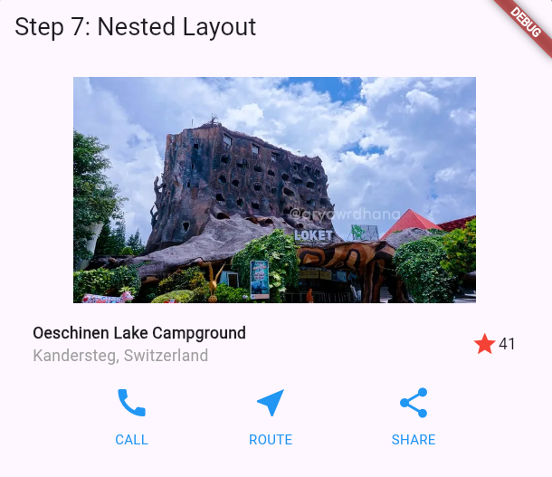
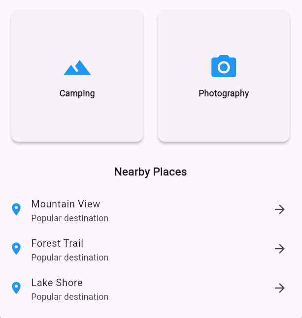

# #06 | Codelabs Layout Basics

## Identitas Mahasiswa

| Keterangan | Detail |
| :--- | :--- |
| **Nama** | Yosep Bima Aprillian |
| **NIM** | 244107060027 |
| **Kelas** | SIB-2D |

---

## 01 Select a layout widget

### Hasil "Select a layout widget":

## 02 Create a visible widget

### Hasil "Create a visible widget":

## 03 Add the visible widget to the layout widget

### Hasil "Add the visible widget to the layout widget":

## 03 Add the visible widget to the layout widget

### Hasil "Add the visible widget to the layout widget":

## 04 Add the layout widget to the page

### Hasil "Add the layout widget to the page":

## 05 Expanded & Image

### Hasil "Expanded & Image":

## 06 Button Column

### Hasil "Button Column":

## 07 Nested Layout

### Hasil "Nested Layout":

## 08 Card & Grid

### Hasil "Card & Grid":

