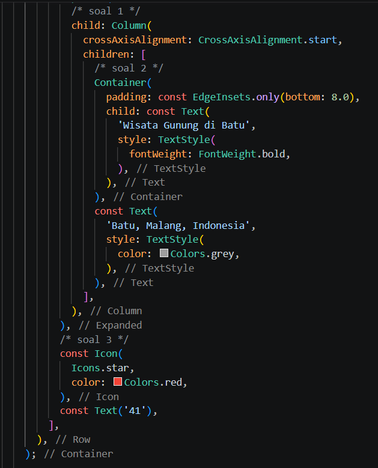
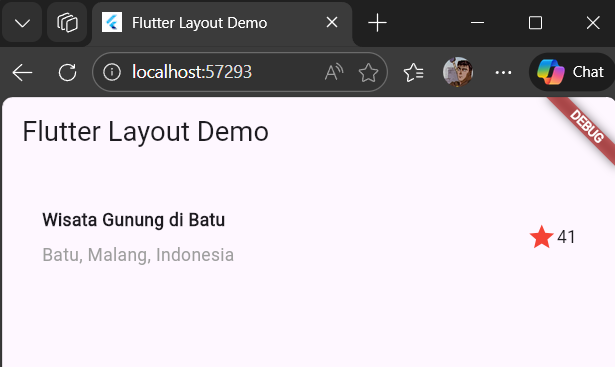
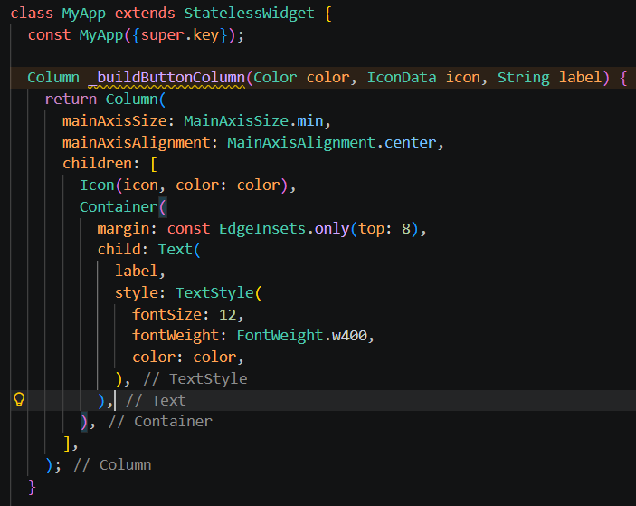
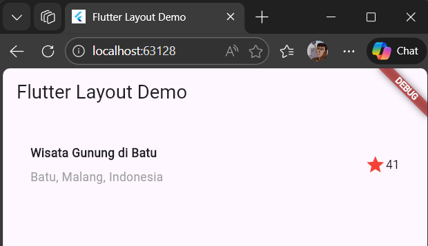
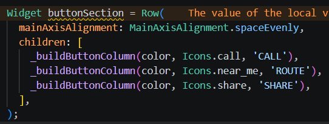
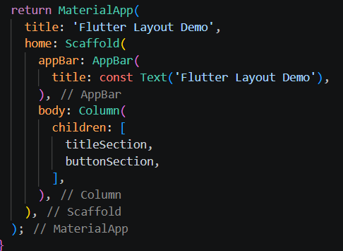
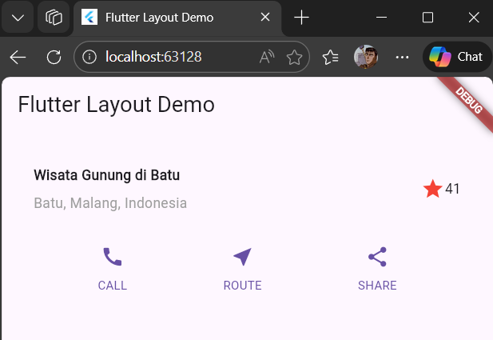
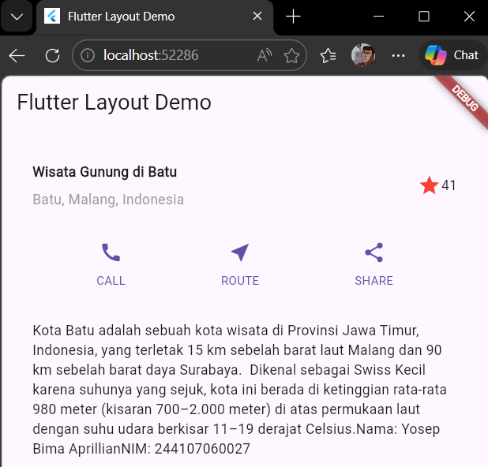
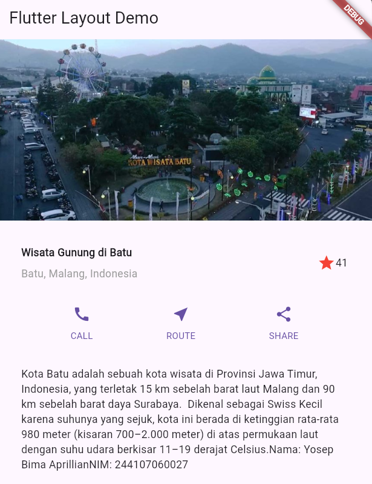
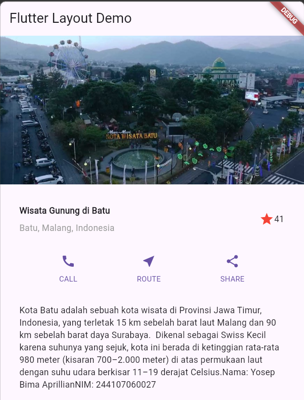

# #06 | Layout dan Navigasi

## Identitas Mahasiswa

| Keterangan | Detail |
| :--- | :--- |
| **Nama** | Yosep Bima Aprillian |
| **NIM** | 244107060027 |
| **Kelas** | SIB-2D |

---

## Tugas Praktikum 1

## Soal 1

**Letakkan widget Column di dalam widget Expanded agar menyesuaikan ruang yang tersisa di dalam widget Row. Tambahkan properti crossAxisAlignment ke CrossAxisAlignment.start sehingga posisi kolom berada di awal baris.**

## Soal 2

**Letakkan baris pertama teks di dalam Container sehingga memungkinkan Anda untuk menambahkan padding = 8. Teks ‘Batu, Malang, Indonesia' di dalam Column, set warna menjadi abu-abu.**

## Soal 3

**Dua item terakhir di baris judul adalah ikon bintang, set dengan warna merah, dan teks "41". Seluruh baris ada di dalam Container dan beri padding di sepanjang setiap tepinya sebesar 32 piksel. Kemudian ganti isi body text ‘Hello World' dengan variabel titleSection seperti berikut:**

### Jawaban Soal 1 - 3:

### Hasil Soal 1 - 3:

## Tugas Praktikum 2

## Langkah 1: Membuat method Column _buildButtonColumn

### Hasil Langkah 1:

## Langkah 2: Membuat widget buttonSection

## Langkah 3: menambah button section ke body

### Hasil Langkah 3:

## Tugas Praktikum 3

## Langkah 1 & 2: Buat widget textSection lalu menambahkan variabel text section ke body

## Tugas Praktikum 4

### Hasil Langkah 1 & 2:

### Hasil Langkah 3:
