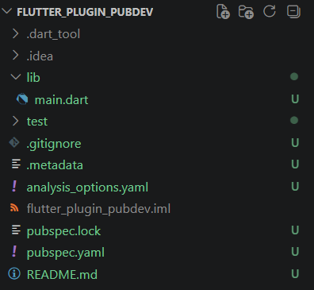
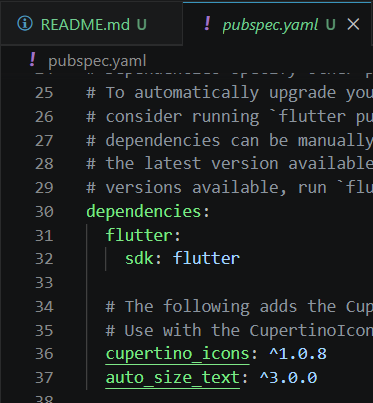
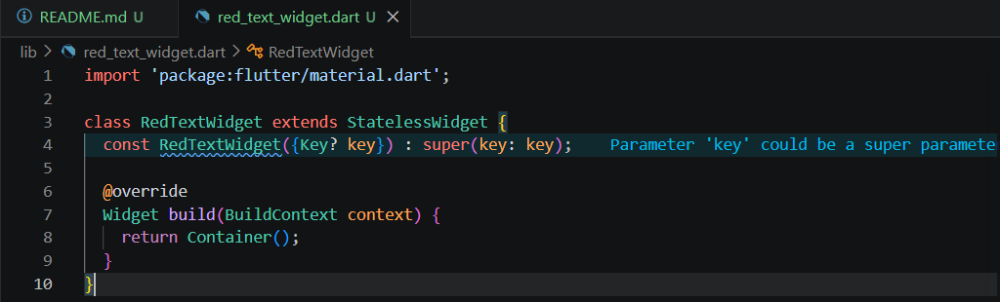
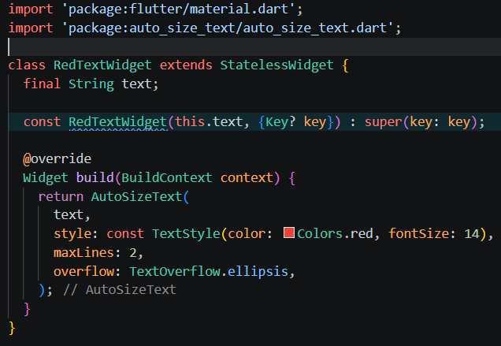
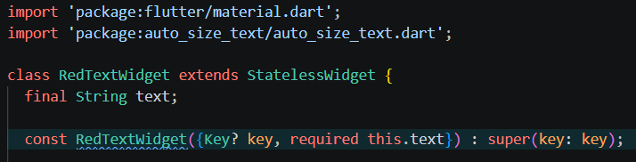
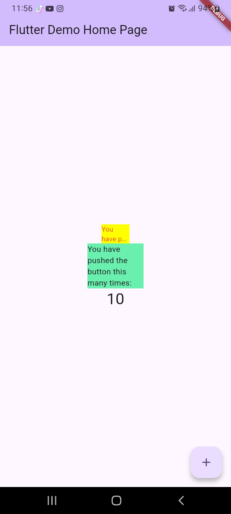

# #07 | Manajemen Plugin

## Identitas Mahasiswa

| Keterangan | Detail |
| :--- | :--- |
| **Nama** | Yosep Bima Aprillian |
| **NIM** | 244107060027 |
| **Kelas** | SIB-2D |

---

# Praktikum Menerapkan Plugin di Project Flutter

## Langkah 1: Buat Project Baru

### Hasil "Buat Project Baru":

## Langkah 2: Menambahkan Plugin

### Hasil "Menambahkan Plugin":

## Langkah 3: Buat file red_text_widget.dart

### Hasil "Membuat file red_text_widget.dart":

## Langkah 4: Tambah Widget AutoSizeText

### Hasil "Menambahkan Widget AutoSizeText":

### Penjelasan Error:
Error terjadi karena AutoSizeText plugin belum di-import, dan variabel text yang digunakan tidak didefinisikan dalam widget.

## Langkah 5: Buat Variabel text dan parameter di constructor

### Hasil "Membuat Variabel text dan parameter di constructor":

## Langkah 6: Tambahkan widget di main.dart

### Hasil "Menambahkan widget di main.dart":

# Tugas Praktikum

## 1. Selesaikan Praktikum dan Dokumentasikan

**Praktikum telah selesai** dengan dokumentasi screenshot di atas beserta penjelasan error pada Langkah 4.

---

## 2. Jelaskan Maksud dari Langkah 2

Langkah ini menambahkan plugin auto_size_text ke file pubspec.yaml. Fungsinya agar ukuran font mengecil secara otomatis menyesuaikan ruang (container) yang tersedia, sehingga mencegah teks terpotong atau keluar dari batas (overflow).

---

## 3. Jelaskan Maksud dari Langkah 5

Langkah ini mengubah RedTextWidget menjadi komponen yang reusable (bisa dipakai berulang kali). Dengan menambahkan parameter required this.text, widget menjadi dinamis karena isi teksnya bisa dibedakan setiap kali widget tersebut dipanggil.

---

## 4. Jelaskan Fungsi dan Perbedaan Dua Widget pada Langkah 6

**Container Kuning (Menggunakan RedTextWidget)**: Menggunakan plugin AutoSizeText dengan lebar container 50. Warna teks diatur menjadi merah dan ukurannya bersifat auto-sizing (otomatis mengecil menyesuaikan ruang yang sempit). Widget ini diberi batas maksimal 2 baris (maxLines: 2), dan jika teks masih terlalu panjang, teks akan dipotong dan diakhiri dengan tanda titik-titik (overflow: TextOverflow.ellipsis).

**Container Hijau (Menggunakan Text Bawaan)**: Menggunakan widget Text standar dari Flutter dengan lebar container 100. Warna teks mengikuti default (hitam) dengan ukuran font yang tetap (fixed). Karena tidak ada batasan jumlah baris, jika teks kepanjangan, teks tersebut akan otomatis turun ke baris baru (wrap text) hingga memakan ruang vertikal ke bawah.

---

## 5. Penjelasan Parameter Plugin AutoSizeText

**text:** Teks atau String utama yang akan ditampilkan ke layar.

**style:** Pengaturan gaya visual teks, seperti warna, jenis font, dan ukuran font referensi/awal sebelum disesuaikan.

**maxLines:** Angka yang membatasi jumlah baris maksimal yang boleh ditempati oleh teks tersebut.

**overflow:** Aturan yang menentukan apa yang terjadi jika teks tetap tidak muat di dalam container meskipun ukurannya sudah diperkecil maksimal (misalnya, menggunakan TextOverflow.ellipsis untuk memotong sisa teks dengan "...").

**minFontSize & maxFontSize:** Batas bawah dan batas atas ukuran font yang diizinkan saat plugin mencoba memperkecil atau memperbesar teks menyesuaikan container.

## 6. Kumpulkan laporan praktikum Anda berupa link repository GitHub kepada dosen!