# #09 | Kamera

## Identitas Mahasiswa

| Keterangan | Detail |
| :--- | :--- |
| **Nama** | Yosep Bima Aprillian |
| **NIM** | 244107060027 |
| **Kelas** | SIB-2D |

---

# Praktikum Menerapkan Plugin di Project Flutter

## Langkah 1: Buat Project Baru

### Hasil "Buat Project Baru":
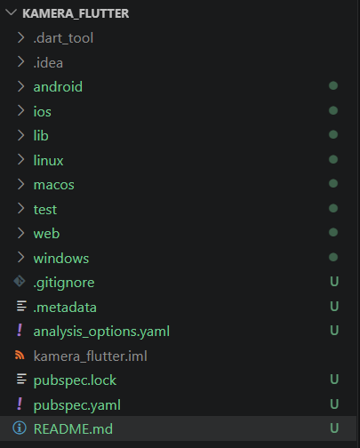

## Langkah 2: Tambah dependensi yang diperlukan

### Hasil "Menambah dependensi yang diperlukan":
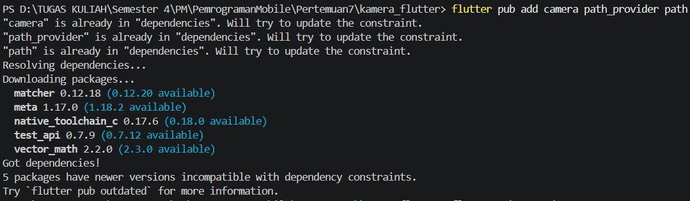

## Langkah 3: Ambil Sensor Kamera dari device

### Hasil "Mengambil Sensor Kamera dari device":
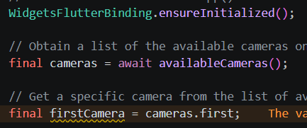

## Langkah 4: Buat dan inisialisasi CameraController

### Hasil "Buat dan inisialisasi CameraController":
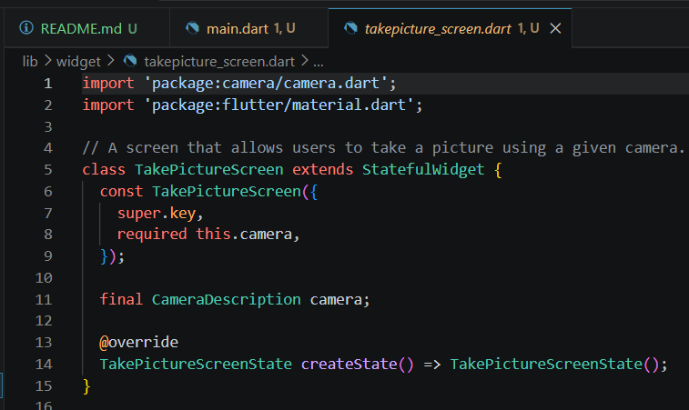

## Langkah 5: Gunakan CameraPreview untuk menampilkan preview foto

### Hasil "Gunakan CameraPreview untuk menampilkan preview foto":
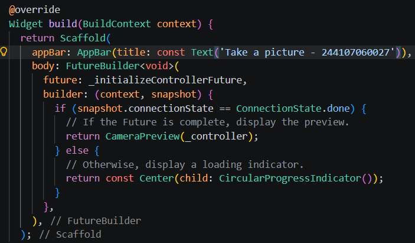

## Langkah 6: Ambil foto dengan CameraController

### Hasil "Ambil foto dengan CameraController":
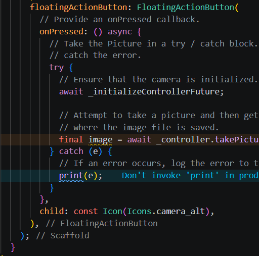

## Langkah 7: Buat widget baru DisplayPictureScreen

### Hasil "Buat widget baru DisplayPictureScreen":
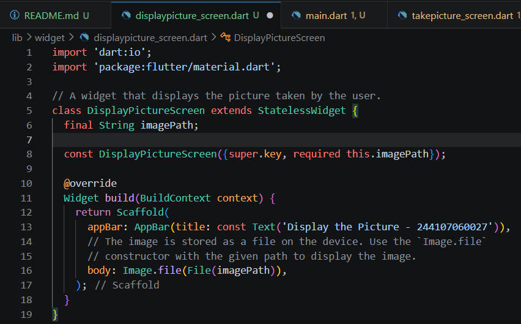

## Langkah 8: Edit main.dart

### Hasil "Edit main.dart":
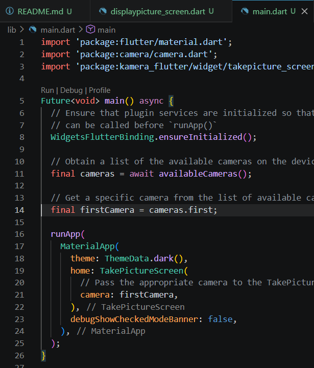

## Langkah 9: Menampilkan hasil foto

### Hasil "Menampilkan hasil foto":
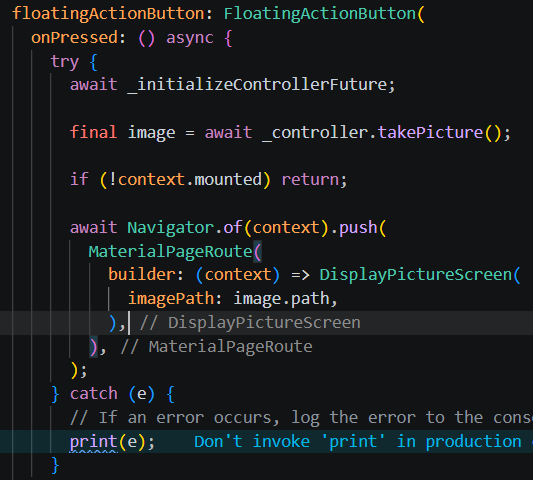

## Hasil Praktikum 1

### Hasil "Hasil Praktikum 1":
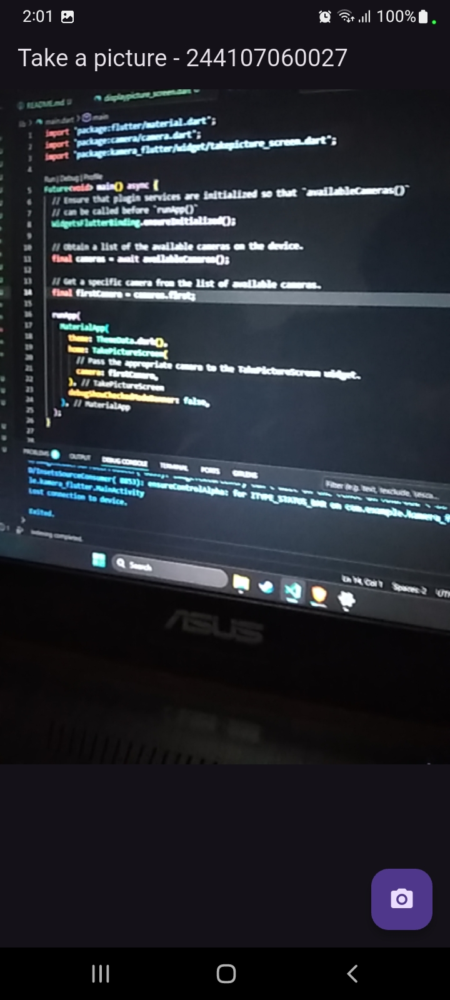
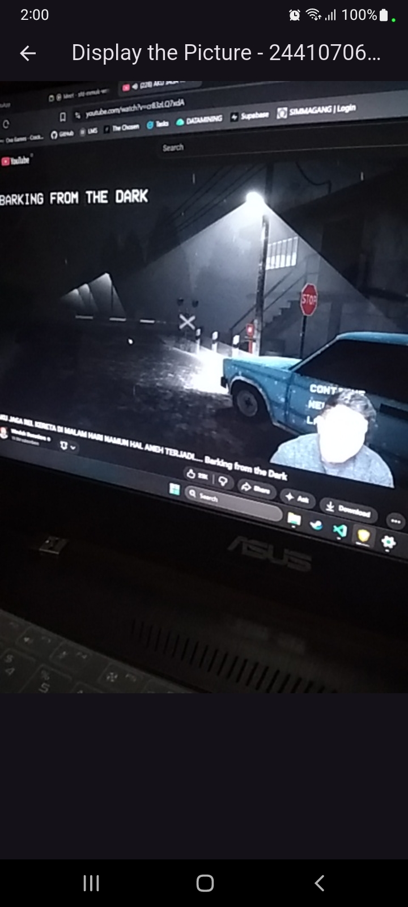