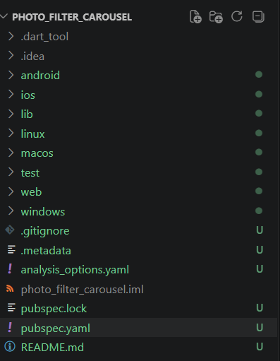
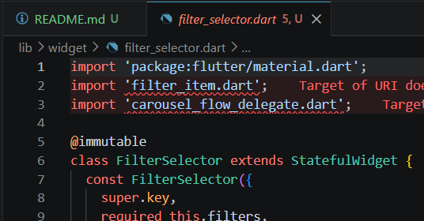
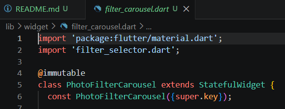
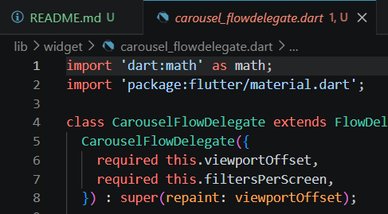
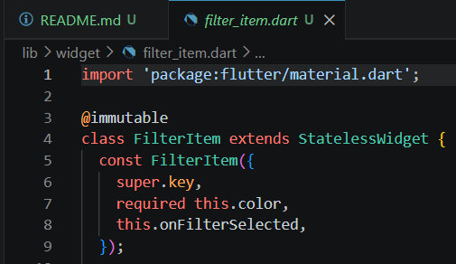
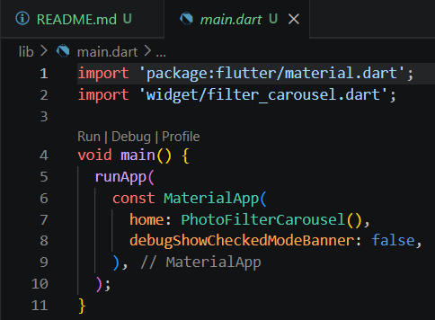
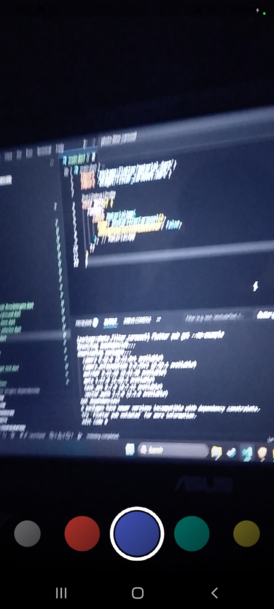
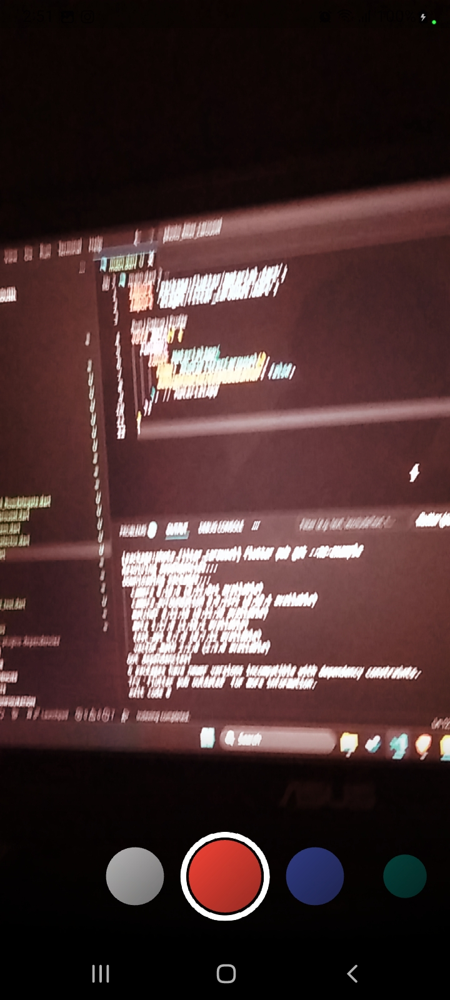
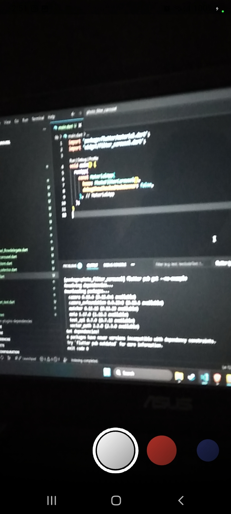

# #09 | Kamera

## Identitas Mahasiswa

| Keterangan | Detail |
| :--- | :--- |
| **Nama** | Yosep Bima Aprillian |
| **NIM** | 244107060027 |
| **Kelas** | SIB-2D |

---

# Praktikum 2: Membuat photo filter carousel

## Langkah 1: Buat Project Baru

### Hasil "Buat Project Baru":

## Langkah 2: Buat widget Selector ring dan dark gradient

### Hasil "Buat widget Selector ring dan dark gradient":

## Langkah 3: Buat widget photo filter carousel

### Hasil "Buat widget photo filter carousel":

## Langkah 4: Membuat filter warna - bagian 1

### Hasil "Membuat filter warna - bagian 1":

## Langkah 5: Membuat filter warna

### Hasil "Membuat filter warna":

## Langkah 6: Implementasi filter carousel

### Hasil "Implementasi filter carousel":

## Hasil Praktikum

### Hasil "Hasil Praktikum":

## Hasil Praktikum