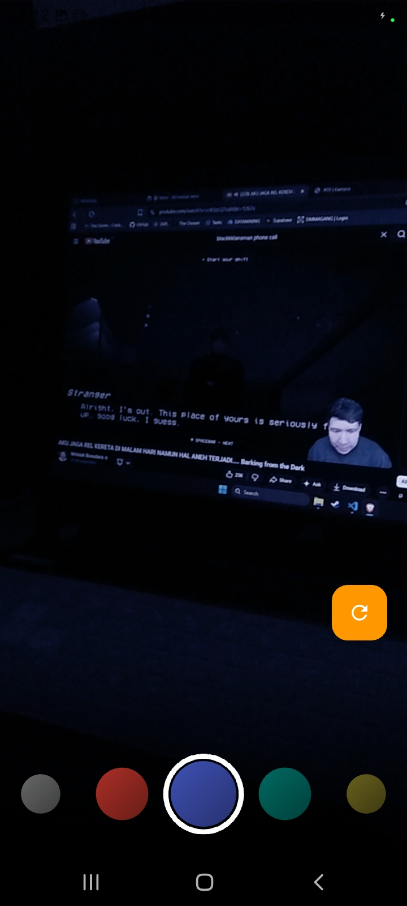
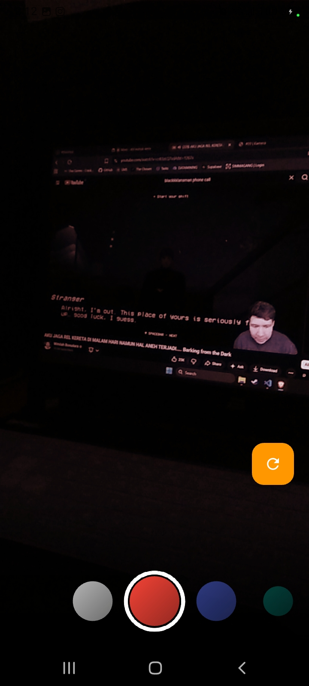
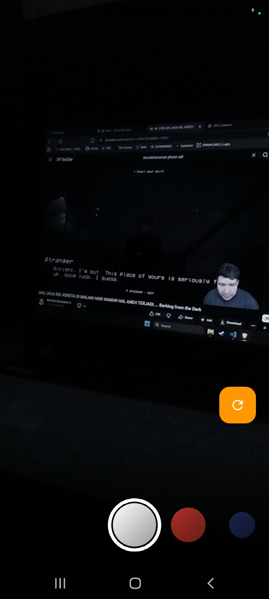

# #09 | Kamera

## Identitas Mahasiswa

| Keterangan | Detail |
| :--- | :--- |
| **Nama** | Yosep Bima Aprillian |
| **NIM** | 244107060027 |
| **Kelas** | SIB-2D |

---

# Tugas Praktikum

## 1. Selesaikan Praktikum 1 dan 2, lalu dokumentasikan dan push ke repository Anda berupa screenshot setiap hasil pekerjaan beserta penjelasannya di file README.md! Jika terdapat error atau kode yang tidak dapat berjalan, silakan Anda perbaiki sesuai tujuan aplikasi dibuat!

**Praktikum telah selesai** dengan dokumentasi screenshot

---

## 2. Gabungkan hasil praktikum 1 dengan hasil praktikum 2 sehingga setelah melakukan pengambilan foto, dapat dibuat filter carouselnya!

### Hasil dari Penggabungan

---

## 2. Gabungkan hasil praktikum 1 dengan hasil praktikum 2 sehingga setelah melakukan pengambilan foto, dapat dibuat filter carouselnya!

---

## 3. Jelaskan maksud void async pada praktikum 1?

void async adalah sebuah fungsi asynchronous yang tidak mengembalikan nilai (void).

---

## 4. Jelaskan fungsi dari anotasi @immutable dan @override ?

Menandai class sebagai immutable = Objek tidak dapat diubah setelah dibuat, dan meningkatkan performa = Flutter bisa mengoptimalkan rendering karena tahu data tidak berubah.

---

## 5. Kumpulkan link commit repository GitHub Anda kepada dosen yang telah disepakati!